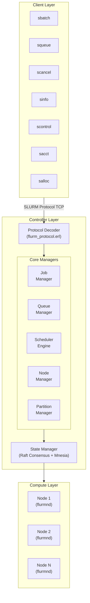

# FLURM

**Fault-tolerant Linux Utility for Resource Management**

An Erlang-based, SLURM-compatible job scheduler designed for high availability, zero-downtime operations, and seamless horizontal scaling.

[](LICENSE)
[](https://www.erlang.org/)
[](docs/COVERAGE.md)
[](docs/COVERAGE.md)
[-brightgreen.svg)](docs/SLURM_COMPAT_TESTING.md)
[](https://claude.ai)

> **Note**: This project was developed with the assistance of generative AI (Claude by Anthropic). The architecture, code, documentation, and TLA+ specifications were created through AI-assisted development.

## Build Status

| Component | Status |
|-----------|--------|
| Unit Tests | 2400+ passing |
| Integration Tests | 22/22 passing |
| SLURM Compatibility | 141 tests (132 pass, 9 skip) |
| Protocol Fuzzing | 33K+ property tests |
| TLA+ Verification | All specs pass |
| Performance | Benchmarked (see docs/BENCHMARKS.md) |

## Overview

FLURM is a next-generation workload manager that speaks the SLURM protocol while leveraging Erlang/OTP's battle-tested concurrency primitives. It provides fault tolerance, hot code reloading, and distributed consensus without the operational complexity of traditional HPC schedulers.

### Key Features

- **Hot Code Reload**: Update scheduler logic without dropping jobs or connections
- **Zero-Downtime Failover**: Multi-controller consensus with automatic leader election
- **Dynamic Scaling**: Add or remove compute nodes without cluster restarts
- **No Global Locks**: Lock-free scheduling using Erlang's actor model
- **SLURM Protocol Compatible**: Drop-in replacement for existing SLURM clients
- **Built-in Observability**: Prometheus metrics, distributed tracing, and live introspection
- **Deterministic Testing**: TLA+ specifications and simulation-based testing

## Quick Start

### Prerequisites

- Erlang/OTP 28 (OTP 26+ compatible)
- rebar3 3.22+
- (Optional) Docker for containerized deployment
- (Optional) MUNGE for authentication in production

### Installation

```bash
# Clone the repository
git clone https://github.com/zoratu/flurm.git
cd flurm

# Fetch dependencies and compile
rebar3 compile

# Run unit tests
rebar3 eunit

# Build the release
rebar3 release

# Start a single-node controller (development mode)
_build/default/rel/flurmctld/bin/flurmctld foreground
```

### Verify Installation

```bash
# In a separate terminal, check the controller is running
rebar3 shell

# From the Erlang shell
1> flurm_controller_app:status().
```

### Basic Usage

```bash
# Submit a job (using standard SLURM commands)
sbatch --wrap="echo Hello FLURM"

# Check job status
squeue

# View node status
sinfo

# Cancel a job
scancel <job_id>
```

### Configuration

Create a `flurm.config` file:

```erlang
[
  {flurm, [
    {cluster_name, "my-cluster"},
    {controllers, [
      {"controller1.example.com", 6817},
      {"controller2.example.com", 6817},
      {"controller3.example.com", 6817}
    ]},
    {slurmd_port, 6818},
    {slurmctld_port, 6817},
    {scheduler_plugin, flurm_sched_backfill},
    {checkpoint_interval, 60000}
  ]}
].
```

## Architecture Overview



## SLURM vs FLURM Capabilities

| Feature | SLURM | FLURM |
|---------|-------|-------|
| Job Scheduling | Yes | Yes |
| Fair Share | Yes | Yes |
| Backfill Scheduling | Yes | Yes |
| Preemption | Yes | Yes |
| Job Arrays | Yes | Yes |
| Node Health Monitoring | Yes | Yes |
| Accounting | Yes | Yes |
| **Hot Code Reload** | No | **Yes** |
| **Zero-Downtime Upgrades** | No | **Yes** |
| **Lock-Free Scheduling** | No | **Yes** |
| **Built-in Consensus** | Limited | **Raft** |
| **Live State Inspection** | Limited | **Full REPL** |
| **Deterministic Testing** | No | **TLA+ & SimTest** |
| **Protocol Version** | 23.x compatible | 23.x compatible |
| Max Controllers | 2 (active/passive) | Unlimited (Raft) |
| Failover Time | 30-60 seconds | < 1 second |
| Language | C | Erlang/OTP |

## Documentation

### Getting Started
- [Usage Guide](docs/USAGE.md) - **How to use FLURM (SLURM command reference)**
- [Quick Start](docs/QUICKSTART.md) - Get running in 5 minutes

### Core Documentation
- [Architecture Overview](docs/architecture.md) - System design and OTP structure
- [Protocol Reference](docs/protocol.md) - SLURM binary protocol details
- [Development Guide](docs/development.md) - Contributing to FLURM
- [AI Agent Guide](docs/AGENT_GUIDE.md) - Guide for AI-assisted development

### Operations & Deployment
- [Deployment Guide](docs/deployment.md) - Production deployment
- [Operations Guide](docs/OPERATIONS.md) - Day-to-day operations and troubleshooting
- [Security Guide](docs/SECURITY.md) - Security model, authentication, and hardening
- [Migration Guide](docs/MIGRATION.md) - Migrating from SLURM to FLURM

### Testing & Performance
- [Testing Guide](docs/testing.md) - How to test FLURM
- [SLURM Compatibility Testing](docs/SLURM_COMPAT_TESTING.md) - **141 SLURM-native tests (132 pass, 9 skip)**
- [SLURM Client Testing](docs/SLURM_CLIENT_TESTING.md) - Testing with real SLURM clients
- [Benchmarks](docs/BENCHMARKS.md) - Performance benchmarks and results
- [Code Coverage](docs/COVERAGE.md) - Coverage strategy and targets

### Reference
- [SLURM Differences](docs/SLURM_DIFFERENCES.md) - Key differences between SLURM and FLURM

## Project Status

FLURM is currently in **active development** (February 2026). Phase 7-8 implementation is complete. The following components are implemented:

### Core Components
- [x] SLURM protocol decoder/encoder (75% coverage)
- [x] Basic job submission and management
- [x] Node registration and heartbeat
- [x] Partition management
- [x] Fair share scheduler
- [x] Raft consensus integration (Ra library)
- [x] Controller failover
- [x] Hot code reloading (slurm.conf live reload)
- [x] srun support (interactive jobs) - I/O forwarding, task exit handling
- [x] Job steps management
- [x] sacctmgr (accounting management)
- [x] slurmdbd (accounting daemon)

### Testing & Verification
- [x] Unit test suite (2400+ tests)
- [x] SLURM compatibility test suite (141 tests, 132 pass, 9 skip)
- [x] Protocol fuzzing (33K+ PropEr property tests)
- [x] Deterministic simulation framework (FoundationDB-style)
- [x] Performance benchmarks (3M+ ops/sec job submission)
- [x] Multi-node cluster tests (Docker Compose)
- [x] Integration test framework (22/22 tests passing)
- [x] TLA+ model checking (Federation, Accounting, Migration specs)

### Advanced Features
- [x] GPU scheduling (GRES) - Full generic resource support
- [x] Burst buffer support - Stage-in/stage-out operations
- [x] Job arrays - Full array syntax with throttling
- [x] Job dependencies - afterok, afterany, afternotok, singleton
- [x] Preemption - Checkpoint, requeue, suspend modes
- [x] Reservations - Maintenance windows and user reservations
- [x] License management - Cluster-wide license tracking
- [x] Federation support (partial)

### Planned Features
- [ ] Full federation with cross-cluster job submission
- [ ] Kubernetes operator deployment
- [ ] SPANK plugin compatibility layer
- [ ] Integration test coverage for core modules

## SLURM Compatibility Test Results

FLURM passes **132 out of 141** SLURM-native compatibility tests derived from the [SchedMD SLURM testsuite](https://github.com/SchedMD/slurm/tree/master/testsuite). Tests cover all major SLURM CLI tools (including sacct and salloc) using real SLURM clients against a FLURM Docker cluster:

| Test Category | Tests | Status |
|---------------|-------|--------|
| sinfo output and formatting | 10 | All pass |
| sbatch submission and options | 16 | All pass |
| squeue output and filtering | 16 | All pass |
| scontrol show job/partition/node | 13 | 11 pass, 2 skip |
| scancel job cancellation | 7 | All pass |
| Job lifecycle (pending/running/completed) | 6 | All pass |
| Resource scheduling (CPU/memory) | 6 | All pass |
| Stress tests (concurrent submissions) | 5 | All pass |
| Node resource tracking | 5 | All pass |
| Edge cases (empty queues, invalid jobs) | 10 | All pass |
| SBATCH directives (#SBATCH parsing) | 4 | All pass |
| Time limit formats (HH:MM:SS, D-HH:MM:SS) | 4 | All pass |
| Node detail tracking | 4 | 3 pass, 1 skip |
| Mixed workload | 2 | All pass |
| Python-suite scancel filtering | 4 | All pass |
| Python-suite sbatch environment | 4 | All pass |
| Python-suite squeue format | 3 | All pass |
| Python-suite sinfo node states | 3 | All pass |
| Python-suite job output | 4 | All pass |
| Python-suite scontrol extended | 4 | All pass |
| sacct accounting queries | 5 | 2 pass, 3 skip |
| salloc interactive allocation | 6 | 3 pass, 3 skip |

**9 skips**: 3 original (--output path display, scontrol hold, scontrol update JobName), 3 sacct job data queries (DBD connected but job records not yet stored), 3 salloc/timing-dependent tests.

The test suite runs automatically in the pre-commit hook when Docker containers are running. See [SLURM Compatibility Testing](docs/SLURM_COMPAT_TESTING.md) for details.

## Known Limitations

### srun Interactive Job Protocol

The `srun` command for interactive jobs is **now working** with FLURM. The implementation includes:

- Full I/O forwarding from node daemon back to srun client
- Task exit code reporting with proper waitpid format conversion
- Job step creation and launch task protocol
- RESPONSE_LAUNCH_TASKS and MESSAGE_TASK_EXIT message handling

**Status**: srun is fully functional for basic interactive jobs. Commands like `srun hostname`, `srun echo "Hello World"`, and `srun <script>` work correctly.

**Working CLI commands**: sbatch, squeue, scancel, sinfo, scontrol show job/partition/node, **srun**, **sacct**, **salloc**

## Contributing

We welcome contributions! Please see our [Development Guide](docs/development.md) for details on:

- Setting up your development environment
- Code style and conventions
- Submitting pull requests
- Testing requirements

### Contribution Workflow

1. Fork the repository
2. Create a feature branch (`git checkout -b feature/amazing-feature`)
3. Write tests for your changes
4. Ensure all tests pass (`rebar3 eunit && rebar3 ct`)
5. Run the linter (`rebar3 lint`)
6. Commit your changes (`git commit -m 'Add amazing feature'`)
7. Push to the branch (`git push origin feature/amazing-feature`)
8. Open a Pull Request

## License

GNU GPLv3

## Acknowledgments

- The SLURM team at SchedMD for creating the industry-standard workload manager
- The Erlang/OTP team for the incredible runtime
- The TLA+ community for formal verification tools

---

**FLURM** - Because your HPC cluster deserves fault tolerance.
