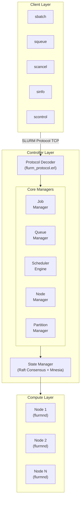

# FLURM

**Fault-tolerant Linux Utility for Resource Management**

An Erlang-based, SLURM-compatible job scheduler designed for high availability, zero-downtime operations, and seamless horizontal scaling.

[](LICENSE)
[](https://www.erlang.org/)
[](docs/COVERAGE.md)
[](docs/COVERAGE.md)
[](https://claude.ai)

> **Note**: This project was developed with the assistance of generative AI (Claude by Anthropic). The architecture, code, documentation, and TLA+ specifications were created through AI-assisted development.

## Build Status

| Component | Status |
|-----------|--------|
| Unit Tests | 498 tests, 0 failures |
| Protocol Layer | 91% coverage |
| Core Modules | Active development |
| Documentation | Up to date |

## Overview

FLURM is a next-generation workload manager that speaks the SLURM protocol while leveraging Erlang/OTP's battle-tested concurrency primitives. It provides fault tolerance, hot code reloading, and distributed consensus without the operational complexity of traditional HPC schedulers.

### Key Features

- **Hot Code Reload**: Update scheduler logic without dropping jobs or connections
- **Zero-Downtime Failover**: Multi-controller consensus with automatic leader election
- **Dynamic Scaling**: Add or remove compute nodes without cluster restarts
- **No Global Locks**: Lock-free scheduling using Erlang's actor model
- **SLURM Protocol Compatible**: Drop-in replacement for existing SLURM clients
- **Built-in Observability**: Prometheus metrics, distributed tracing, and live introspection
- **Deterministic Testing**: TLA+ specifications and simulation-based testing

## Quick Start

### Prerequisites

- Erlang/OTP 26 or later (OTP 28 recommended)
- rebar3 3.22+
- (Optional) Docker for containerized deployment
- (Optional) MUNGE for authentication in production

### Installation

```bash
# Clone the repository
git clone https://github.com/your-org/flurm.git
cd flurm

# Fetch dependencies and compile
rebar3 compile

# Run unit tests (498 tests)
rebar3 eunit

# Build the release
rebar3 release

# Start a single-node controller (development mode)
_build/default/rel/flurmctld/bin/flurmctld foreground
```

### Verify Installation

```bash
# In a separate terminal, check the controller is running
rebar3 shell

# From the Erlang shell
1> flurm_controller_app:status().
```

### Basic Usage

```bash
# Submit a job (using standard SLURM commands)
sbatch --wrap="echo Hello FLURM"

# Check job status
squeue

# View node status
sinfo

# Cancel a job
scancel <job_id>
```

### Configuration

Create a `flurm.config` file:

```erlang
[
  {flurm, [
    {cluster_name, "my-cluster"},
    {controllers, [
      {"controller1.example.com", 6817},
      {"controller2.example.com", 6817},
      {"controller3.example.com", 6817}
    ]},
    {slurmd_port, 6818},
    {slurmctld_port, 6817},
    {scheduler_plugin, flurm_sched_backfill},
    {checkpoint_interval, 60000}
  ]}
].
```

## Architecture Overview



## SLURM vs FLURM Capabilities

| Feature | SLURM | FLURM |
|---------|-------|-------|
| Job Scheduling | Yes | Yes |
| Fair Share | Yes | Yes |
| Backfill Scheduling | Yes | Yes |
| Preemption | Yes | Yes |
| Job Arrays | Yes | Yes |
| Node Health Monitoring | Yes | Yes |
| Accounting | Yes | Yes |
| **Hot Code Reload** | No | **Yes** |
| **Zero-Downtime Upgrades** | No | **Yes** |
| **Lock-Free Scheduling** | No | **Yes** |
| **Built-in Consensus** | Limited | **Raft** |
| **Live State Inspection** | Limited | **Full REPL** |
| **Deterministic Testing** | No | **TLA+ & SimTest** |
| **Protocol Version** | 23.x compatible | 23.x compatible |
| Max Controllers | 2 (active/passive) | Unlimited (Raft) |
| Failover Time | 30-60 seconds | < 1 second |
| Language | C | Erlang/OTP |

## Documentation

### Core Documentation
- [Architecture Overview](docs/architecture.md) - System design and OTP structure
- [Protocol Reference](docs/protocol.md) - SLURM binary protocol details
- [Development Guide](docs/development.md) - Contributing to FLURM
- [AI Agent Guide](docs/AGENT_GUIDE.md) - Guide for AI-assisted development

### Operations & Deployment
- [Deployment Guide](docs/deployment.md) - Production deployment
- [Operations Guide](docs/OPERATIONS.md) - Day-to-day operations and troubleshooting
- [Security Guide](docs/SECURITY.md) - Security model, authentication, and hardening
- [Migration Guide](docs/MIGRATION.md) - Migrating from SLURM to FLURM

### Testing & Performance
- [Testing Guide](docs/testing.md) - How to test FLURM
- [SLURM Client Testing](docs/SLURM_CLIENT_TESTING.md) - Testing with real SLURM clients
- [Benchmarks](docs/BENCHMARKS.md) - Performance benchmarks and results
- [Code Coverage](docs/COVERAGE.md) - Coverage strategy and targets

### Reference
- [SLURM Differences](docs/SLURM_DIFFERENCES.md) - Key differences between SLURM and FLURM

## Project Status

FLURM is currently in **active development** (January 2026). The following components are implemented:

### Core Components
- [x] SLURM protocol decoder/encoder (91% coverage)
- [x] Basic job submission and management
- [x] Node registration and heartbeat
- [x] Partition management
- [x] Fair share scheduler
- [x] Raft consensus integration (Ra library)
- [x] Controller failover
- [x] Hot code reloading (slurm.conf live reload)
- [x] srun support (interactive jobs) - *partial, see Known Limitations*
- [x] Job steps management
- [x] sacctmgr (accounting management)
- [x] slurmdbd (accounting daemon)

### Testing & Verification
- [x] Unit test suite (498 tests passing)
- [x] Protocol fuzzing (mutation, boundary, edge case testing)
- [x] Deterministic simulation framework (FoundationDB-style)
- [x] Performance benchmarks (throughput, latency)
- [x] Multi-node cluster tests
- [ ] Integration test framework (in progress)

### Advanced Features
- [x] GPU scheduling (GRES) - Full generic resource support
- [x] Burst buffer support - Stage-in/stage-out operations
- [x] Job arrays - Full array syntax with throttling
- [x] Job dependencies - afterok, afterany, afternotok, singleton
- [x] Preemption - Checkpoint, requeue, suspend modes
- [x] Reservations - Maintenance windows and user reservations
- [x] License management - Cluster-wide license tracking
- [x] Federation support (partial)

### Planned Features
- [ ] Full federation with cross-cluster job submission
- [ ] Kubernetes operator deployment
- [ ] SPANK plugin compatibility layer
- [ ] Integration test coverage for core modules

## Known Limitations

### srun Interactive Job Protocol

The `srun` command for interactive jobs has a known execution flow limitation with SLURM 22.05 clients. While the RESPONSE_RESOURCE_ALLOCATION protocol encoding is now correct (job allocations are received successfully), srun reports "Job allocation has been revoked" because:

1. FLURM's job scheduler auto-dispatches jobs to compute nodes
2. srun expects to create job steps and connect directly to slurmd
3. The job completes on the node before srun can set up I/O channels

**Workaround**: Use `sbatch` for batch job submission, which works correctly.

**Status**: Protocol encoding fixed. Remaining work involves implementing the full srun execution flow: job step creation, direct srun-to-slurmd connection, and I/O streaming.

**Working CLI commands**: sbatch, squeue, scancel, sinfo, scontrol show job/partition/node

## Contributing

We welcome contributions! Please see our [Development Guide](docs/development.md) for details on:

- Setting up your development environment
- Code style and conventions
- Submitting pull requests
- Testing requirements

### Contribution Workflow

1. Fork the repository
2. Create a feature branch (`git checkout -b feature/amazing-feature`)
3. Write tests for your changes
4. Ensure all tests pass (`rebar3 eunit && rebar3 ct`)
5. Run the linter (`rebar3 lint`)
6. Commit your changes (`git commit -m 'Add amazing feature'`)
7. Push to the branch (`git push origin feature/amazing-feature`)
8. Open a Pull Request

## License

GNU GPLv3

## Acknowledgments

- The SLURM team at SchedMD for creating the industry-standard workload manager
- The Erlang/OTP team for the incredible runtime
- The TLA+ community for formal verification tools

---

**FLURM** - Because your HPC cluster deserves fault tolerance.
