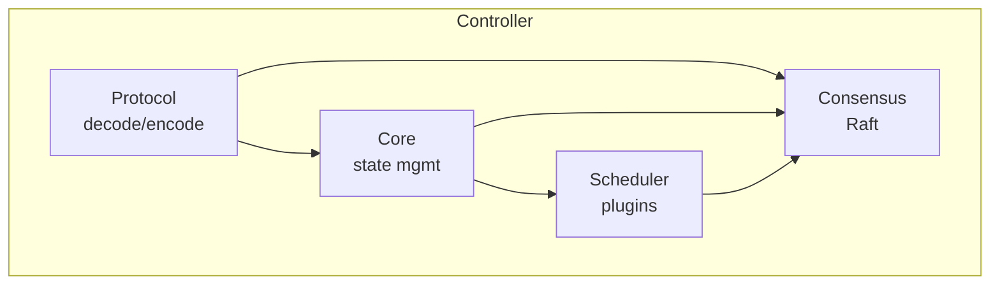

# FLURM Agent Development Guide

This guide is specifically designed for AI agents (Claude, GPT, Copilot, etc.) working on the FLURM codebase. It provides structured information to help agents quickly understand the project, resume work after context loss, and maintain consistency across development sessions.

## Table of Contents

1. [Quick Reference](#quick-reference)
2. [Project Overview](#project-overview)
3. [Key Files and Their Purposes](#key-files-and-their-purposes)
4. [Checkpoint System](#checkpoint-system)
5. [Resuming Work After Context Loss](#resuming-work-after-context-loss)
6. [Common Patterns](#common-patterns)
7. [Testing Requirements](#testing-requirements)
8. [Parallel Work Boundaries](#parallel-work-boundaries)
9. [Updating checkpoint.json](#updating-checkpointjson)
10. [Error Handling Patterns](#error-handling-patterns)
11. [Naming Conventions](#naming-conventions)
12. [Common Tasks Cheat Sheet](#common-tasks-cheat-sheet)

## Quick Reference

```
Project:    FLURM - Erlang-based SLURM-compatible job scheduler
Language:   Erlang/OTP 26+
Build:      rebar3
Tests:      rebar3 eunit && rebar3 ct && rebar3 proper
Shell:      rebar3 shell
Docs:       /docs/*.md
Checkpoint: /checkpoint.json
```

### Critical Files to Read First

1. `checkpoint.json` - Current work state and progress
2. `README.md` - Project overview
3. `docs/architecture.md` - System design
4. `rebar.config` - Dependencies and build config

## Project Overview

FLURM is a fault-tolerant job scheduler that:
- Speaks the SLURM binary protocol (compatible with sbatch, squeue, etc.)
- Uses Erlang/OTP for fault tolerance and hot code reload
- Implements Raft consensus for multi-controller HA
- Provides lock-free scheduling via the actor model

### Core Concepts

| Concept | Description | Key Module |
|---------|-------------|------------|
| Job | A unit of work to be scheduled | `flurm_job_manager` |
| Node | A compute resource that runs jobs | `flurm_node_manager` |
| Partition | A logical grouping of nodes | `flurm_partition_manager` |
| Queue | Ordered list of pending jobs | `flurm_queue_manager` |
| Scheduler | Matches jobs to nodes | `flurm_scheduler_engine` |
| Controller | The main daemon (slurmctld) | `flurm_app` |

### Architecture at a Glance



## Key Files and Their Purposes

### Application Core

| File | Purpose | When to Modify |
|------|---------|----------------|
| `apps/flurm/src/flurm_app.erl` | Application entry point | Rarely; startup logic |
| `apps/flurm/src/flurm_sup.erl` | Root supervisor | Adding new subsystems |
| `apps/flurm/src/flurm_job_manager.erl` | Job lifecycle management | Job state changes |
| `apps/flurm/src/flurm_node_manager.erl` | Node tracking | Node state changes |
| `apps/flurm/src/flurm_queue_manager.erl` | Job queue operations | Queue algorithms |
| `apps/flurm/src/flurm_state_manager.erl` | Mnesia state persistence | State schema changes |

### Protocol Layer

| File | Purpose | When to Modify |
|------|---------|----------------|
| `apps/flurm_protocol/src/flurm_protocol.erl` | Binary encode/decode | New message types |
| `apps/flurm_protocol/src/flurm_acceptor.erl` | TCP listener | Connection handling |
| `apps/flurm_protocol/src/flurm_connection.erl` | Per-connection handler | Request routing |
| `apps/flurm_protocol/include/flurm_protocol.hrl` | Protocol constants | Message type IDs |

### Scheduler

| File | Purpose | When to Modify |
|------|---------|----------------|
| `apps/flurm_scheduler/src/flurm_scheduler_engine.erl` | Scheduler orchestrator | Scheduling cycle |
| `apps/flurm_scheduler/src/flurm_sched_fifo.erl` | FIFO plugin | Simple scheduling |
| `apps/flurm_scheduler/src/flurm_sched_backfill.erl` | Backfill plugin | Advanced scheduling |
| `apps/flurm_scheduler/src/flurm_sched_fairshare.erl` | Fair share plugin | User quotas |

### Consensus

| File | Purpose | When to Modify |
|------|---------|----------------|
| `apps/flurm_consensus/src/flurm_consensus.erl` | Raft state machine | Consensus logic |
| `apps/flurm_consensus/src/flurm_raft_log.erl` | Log management | Log persistence |
| `apps/flurm_consensus/src/flurm_raft_rpc.erl` | Inter-node RPC | Network protocol |

### Configuration

| File | Purpose |
|------|---------|
| `rebar.config` | Build configuration, dependencies |
| `config/sys.config` | Production configuration |
| `config/dev.config` | Development configuration |
| `config/test.config` | Test configuration |

### Tests

| Directory | Test Type |
|-----------|-----------|
| `test/unit/` | EUnit tests |
| `test/property/` | PropEr tests |
| `test/integration/` | Common Test suites |
| `test/simulation/` | Deterministic simulation |

## Checkpoint System

FLURM uses a `checkpoint.json` file to track development progress across sessions.

### Checkpoint Structure

```json
{
  "version": "1.0.0",
  "last_updated": "2024-01-15T10:30:00Z",
  "current_task": {
    "id": "FLURM-123",
    "description": "Implement job array support",
    "status": "in_progress",
    "branch": "feature/job-arrays",
    "started": "2024-01-14T09:00:00Z"
  },
  "completed_tasks": [
    {
      "id": "FLURM-100",
      "description": "Basic protocol decoder",
      "completed": "2024-01-10T15:00:00Z"
    }
  ],
  "pending_tasks": [
    {
      "id": "FLURM-124",
      "description": "Job array squeue display",
      "priority": "high",
      "depends_on": ["FLURM-123"]
    }
  ],
  "notes": [
    "Job array index stored in job_info.array_task_id",
    "Using 0-based indexing internally, 1-based for display"
  ],
  "blocking_issues": [],
  "files_modified": [
    "apps/flurm/src/flurm_job_manager.erl",
    "apps/flurm_protocol/src/flurm_protocol.erl"
  ]
}
```

### Checkpoint Fields

| Field | Purpose |
|-------|---------|
| `current_task` | What is actively being worked on |
| `completed_tasks` | History of finished work |
| `pending_tasks` | Backlog of future work |
| `notes` | Important context for future sessions |
| `blocking_issues` | Problems that need resolution |
| `files_modified` | Files changed in current task |

## Resuming Work After Context Loss

When starting a new session, follow this procedure:

### Step 1: Read State

```bash
# Read checkpoint first
cat checkpoint.json

# Check git status
git status
git log --oneline -5
git diff --stat
```

### Step 2: Understand Context

1. Read `checkpoint.json` completely
2. Note the `current_task` and its status
3. Review `notes` for important context
4. Check `blocking_issues` for problems

### Step 3: Verify State

```bash
# Ensure builds work
rebar3 compile

# Run tests to verify nothing is broken
rebar3 eunit --module=$(current_module)
```

### Step 4: Resume Work

1. Continue from where `current_task.status` indicates
2. Review `files_modified` to understand scope
3. Check `pending_tasks` for dependencies

### Example Resume Session

```
Agent: I see from checkpoint.json that I was working on FLURM-123
(job array support). The status is "in_progress" and notes indicate
I'm using 0-based indexing internally. Let me check the current state
of flurm_job_manager.erl...

[reads file, continues work]
```

## Common Patterns

### gen_server Pattern

All FLURM managers follow this pattern:

```erlang
-module(flurm_example_manager).
-behaviour(gen_server).

%% API
-export([start_link/0]).
-export([create/1, get/1, update/2, delete/1]).

%% Callbacks
-export([init/1, handle_call/3, handle_cast/2, handle_info/2]).

-record(state, {
    items = #{} :: #{id() => item()}
}).

%%% API %%%

start_link() ->
    gen_server:start_link({local, ?MODULE}, ?MODULE, [], []).

create(Item) ->
    gen_server:call(?MODULE, {create, Item}).

%%% Callbacks %%%

init([]) ->
    {ok, #state{}}.

handle_call({create, Item}, _From, State) ->
    {Result, NewState} = do_create(Item, State),
    {reply, Result, NewState}.
```

### Error Tuple Pattern

Always return tagged tuples:

```erlang
%% Good
-spec get_job(job_id()) -> {ok, job()} | {error, not_found}.

%% Bad
-spec get_job(job_id()) -> job() | undefined.
```

### Binary Pattern Matching

Protocol decoding uses binary patterns:

```erlang
decode(<<Type:16/big, Length:32/big, Data:Length/binary, Rest/binary>>) ->
    {ok, {Type, Data}, Rest};
decode(_) ->
    {error, incomplete}.
```

### Process Dictionary Avoidance

Never use process dictionary. Use state records:

```erlang
%% Bad
put(current_job, Job),
Job = get(current_job).

%% Good
State#state{current_job = Job},
Job = State#state.current_job.
```

### Supervision Tree Pattern

```erlang
%% Supervisor init
init([]) ->
    SupFlags = #{
        strategy => one_for_one,
        intensity => 10,
        period => 60
    },
    Children = [
        #{id => child1,
          start => {child1, start_link, []},
          restart => permanent,
          type => worker}
    ],
    {ok, {SupFlags, Children}}.
```

## Testing Requirements

### Before Every Commit

```bash
# All must pass
rebar3 eunit            # Unit tests
rebar3 ct               # Integration tests
rebar3 dialyzer         # Type checking
```

### Test Coverage Requirements

| Component | Minimum |
|-----------|---------|
| Protocol | 90% |
| Core managers | 85% |
| Scheduler plugins | 80% |
| Overall | 80% |

### Writing Tests

```erlang
%% Unit test example
my_function_test() ->
    %% Setup
    Input = make_test_input(),

    %% Exercise
    Result = my_function(Input),

    %% Verify
    ?assertEqual(expected, Result).

%% Property test example
prop_roundtrip() ->
    ?FORALL(Value, any_value(),
            begin
                Encoded = encode(Value),
                {ok, Decoded} = decode(Encoded),
                Value =:= Decoded
            end).
```

## Parallel Work Boundaries

These components can be worked on independently:

### Safe to Parallelize

| Component A | Component B | Notes |
|-------------|-------------|-------|
| Protocol decoder | Scheduler plugins | Different apps |
| Unit tests | TLA+ specs | No code overlap |
| Documentation | Test fixtures | No code overlap |
| New scheduler plugin | Existing plugins | Plugin isolation |

### Must Be Sequential

| Task A | Task B | Reason |
|--------|--------|--------|
| Message type definition | Handler implementation | Dependency |
| State record changes | Code using records | Compilation |
| Mnesia schema change | Queries using schema | Migration |

### Parallel Work Markers

Use these in checkpoint.json:

```json
{
  "parallel_safe": [
    "flurm_sched_priority (new plugin)",
    "test/property/protocol_props.erl"
  ],
  "sequential_with": {
    "flurm_protocol.erl": ["flurm_connection.erl"]
  }
}
```

## Updating checkpoint.json

### When to Update

1. **Starting a task**: Set `current_task`
2. **Completing a task**: Move to `completed_tasks`
3. **Discovering issues**: Add to `blocking_issues`
4. **Important decisions**: Add to `notes`
5. **Modifying files**: Update `files_modified`

### Update Example

```json
{
  "current_task": {
    "id": "FLURM-123",
    "status": "in_progress",
    "progress": "Decoder complete, working on encoder"
  },
  "notes": [
    "PREVIOUS: Job array index stored in job_info.array_task_id",
    "NEW: Added array_max_id field for array size tracking"
  ],
  "files_modified": [
    "apps/flurm/src/flurm_job_manager.erl",
    "apps/flurm_protocol/src/flurm_protocol.erl",
    "apps/flurm/include/flurm_records.hrl"
  ]
}
```

### Checkpoint Hygiene

- Keep `notes` concise but complete
- Clear `blocking_issues` when resolved
- Archive old `completed_tasks` periodically
- Always update `last_updated` timestamp

## Error Handling Patterns

### Tagged Tuples

```erlang
%% Standard result types
-type ok_result() :: {ok, term()}.
-type error_result() :: {error, error_reason()}.
-type result() :: ok_result() | error_result().

-type error_reason() ::
    not_found |
    invalid_input |
    permission_denied |
    {internal, term()}.
```

### Error Propagation

```erlang
%% Chain operations with case
process_request(Request) ->
    case validate(Request) of
        {ok, Validated} ->
            case execute(Validated) of
                {ok, Result} ->
                    {ok, format(Result)};
                {error, _} = Error ->
                    Error
            end;
        {error, _} = Error ->
            Error
    end.
```

### Logging Errors

```erlang
-include_lib("kernel/include/logger.hrl").

handle_error({error, not_found}) ->
    ?LOG_WARNING("Resource not found"),
    {error, not_found};
handle_error({error, Reason}) ->
    ?LOG_ERROR("Unexpected error: ~p", [Reason]),
    {error, internal}.
```

### Crash vs Return Error

```erlang
%% Crash on programmer error (bad arguments)
validate(X) when not is_integer(X) ->
    erlang:error(badarg);

%% Return error on runtime conditions
get_item(Id) ->
    case lookup(Id) of
        {ok, Item} -> {ok, Item};
        error -> {error, not_found}  % Don't crash
    end.
```

## Naming Conventions

### Modules

```
flurm_<component>_<role>.erl

Examples:
- flurm_job_manager.erl      (job + manager)
- flurm_sched_backfill.erl   (scheduler + algorithm)
- flurm_protocol_tests.erl   (protocol + tests)
```

### Functions

```erlang
%% Public API: verb_noun
submit_job(Job) -> ...
cancel_job(JobId) -> ...
get_node_info(NodeName) -> ...

%% Internal: do_verb or verb_impl
do_submit(Job, State) -> ...
validate_impl(Data) -> ...

%% Predicates: is_* or has_*
is_valid(X) -> true | false.
has_permission(User, Action) -> boolean().

%% Conversions: to_* or from_*
to_binary(Term) -> binary().
from_json(Json) -> term().
```

### Variables

```erlang
%% CamelCase, descriptive
JobSpec, NodeList, CurrentState, NewState

%% Avoid single letters except:
%% - N for counts
%% - T for time
%% - Acc for accumulators
%% - H, T for head/tail

%% State always named State, NewState
handle_call(Request, _From, State) ->
    NewState = process(Request, State),
    {reply, ok, NewState}.
```

### Records

```erlang
%% snake_case, prefixed with module concept
-record(job_info, {...}).
-record(node_state, {...}).
-record(msg_header, {...}).
```

## Common Tasks Cheat Sheet

### Add a New Message Type

1. Define constant in `flurm_protocol.hrl`
2. Define record in `flurm_protocol.hrl`
3. Add decoder clause in `flurm_protocol.erl`
4. Add encoder clause in `flurm_protocol.erl`
5. Add handler in `flurm_connection.erl`
6. Add tests in `test/unit/flurm_protocol_tests.erl`

### Add a New Scheduler Plugin

1. Create `apps/flurm_scheduler/src/flurm_sched_<name>.erl`
2. Implement `flurm_scheduler_plugin` behaviour
3. Register in `config/sys.config`
4. Add tests in `test/unit/flurm_sched_<name>_tests.erl`

### Add a New Configuration Option

1. Document in `docs/deployment.md`
2. Add default in `config/sys.config`
3. Read with `application:get_env/3` in code
4. Add to validation in `flurm_config.erl`

### Debug a Process

```erlang
%% In shell
sys:get_state(flurm_job_manager).
sys:trace(flurm_job_manager, true).
recon:proc_count(memory, 5).
```

### Fix a Failing Test

1. Run single test: `rebar3 eunit --module=<module> --test=<test>`
2. Add debug output: `?debugFmt("Value: ~p", [Value])`
3. Check test setup/teardown
4. Verify mock expectations

---

## Summary for Agents

When starting work on FLURM:

1. **Read `checkpoint.json` first** - understand current state
2. **Check git status** - see uncommitted changes
3. **Run tests** - verify baseline works
4. **Follow patterns** - use existing code as template
5. **Update checkpoint** - keep state current
6. **Test before commit** - all tests must pass

Key principles:
- Erlang/OTP patterns everywhere
- Tagged tuples for errors
- Tests are mandatory
- Checkpoint is source of truth for progress

For questions not covered here, check:
- `docs/architecture.md` for system design
- `docs/development.md` for coding standards
- `docs/testing.md` for test requirements
