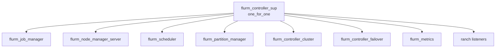

# FLURM Operations Guide

This document covers day-to-day operations, monitoring, troubleshooting, and maintenance tasks for FLURM workload manager deployments.

## Table of Contents

1. [Operational Overview](#operational-overview)
2. [Starting and Stopping](#starting-and-stopping)
3. [Configuration Management](#configuration-management)
4. [Monitoring](#monitoring)
5. [Troubleshooting Guide](#troubleshooting-guide)
6. [Backup and Recovery](#backup-and-recovery)
7. [Maintenance Tasks](#maintenance-tasks)
8. [Performance Tuning](#performance-tuning)

---

## Operational Overview

### FLURM Architecture

FLURM consists of three main daemon types:

#### Controller Daemon (flurmctld)

The central controller responsible for:
- Job scheduling and lifecycle management
- Node management and resource tracking
- Partition/queue management
- Cluster coordination via Ra (Raft consensus)
- SLURM protocol client connections (port 6817)
- Node daemon connections (port 6819)

Key processes managed by the controller supervisor:
- `flurm_job_manager` - Job submission, tracking, and state management
- `flurm_node_manager_server` - Compute node registration and heartbeats
- `flurm_scheduler` - FIFO/backfill job scheduling
- `flurm_partition_manager` - Queue/partition configuration
- `flurm_controller_cluster` - Ra-based cluster coordination
- `flurm_controller_failover` - Leader election and failover handling
- `flurm_metrics` - Prometheus metrics collection

#### Node Daemon (flurmnd)

Runs on each compute node and handles:
- Resource reporting (CPUs, memory, GPUs)
- Job execution (prolog/epilog scripts)
- Heartbeat communication with controllers
- State persistence across restarts

Configuration location: `/etc/flurm/node.config`

#### Accounting Daemon (flurmbd)

Provides job accounting and usage tracking:
- Job completion records
- Resource usage aggregation
- User/account fairshare data

Storage backends: Mnesia (default) or ETS (in-memory)

### Process Supervision and Auto-Restart

FLURM uses OTP supervision trees for automatic process restart:



If any supervised process crashes, the supervisor automatically restarts it. The `one_for_one` strategy ensures only the failed process is restarted, not siblings.

### High Availability (Multi-Controller)

For production deployments, run at least 3 controllers for high availability:

- Uses Ra (Raft) consensus for state replication
- Automatic leader election when leader fails
- State is replicated across all controllers
- Clients can connect to any controller (requests forwarded to leader)

---

## Starting and Stopping

### Systemd Commands

#### Controller Daemon

```bash
# Start the controller
sudo systemctl start flurmctld

# Stop the controller
sudo systemctl stop flurmctld

# Restart the controller
sudo systemctl restart flurmctld

# Check status
sudo systemctl status flurmctld

# View logs
sudo journalctl -u flurmctld -f
```

#### Node Daemon

```bash
# Start the node daemon
sudo systemctl start flurmnd

# Stop the node daemon
sudo systemctl stop flurmnd

# Check status
sudo systemctl status flurmnd
```

#### Accounting Daemon

```bash
sudo systemctl start flurmbd
sudo systemctl stop flurmbd
sudo systemctl status flurmbd
```

### Manual Start (Development/Testing)

```bash
# Controller (foreground mode)
_build/default/rel/flurmctld/bin/flurmctld foreground

# Controller (background mode)
_build/prod/rel/flurmctld/bin/flurmctld start

# Remote console (attach to running controller)
_build/prod/rel/flurmctld/bin/flurmctld remote_console
```

### Graceful Shutdown Procedures

#### Draining Jobs Before Shutdown

For planned maintenance, drain running jobs gracefully:

```bash
# Prevent new jobs from starting on the controller
# (set all partitions to drain state)
scontrol update PartitionName=batch State=DRAIN

# Wait for running jobs to complete
squeue -t running

# When all jobs complete, stop the controller
sudo systemctl stop flurmctld
```

#### Controller Shutdown Sequence

The controller performs graceful shutdown automatically:

1. Stops accepting new connections (`prep_stop/1`)
2. Waits 1 second for in-flight requests to complete
3. Stops ranch listeners
4. Terminates supervisor tree

From Erlang console:
```erlang
%% Graceful application stop
application:stop(flurm_controller).
```

### Emergency Stop Procedures

If a controller is unresponsive:

```bash
# Force kill the Erlang VM
sudo systemctl kill -s SIGKILL flurmctld

# Or find and kill the BEAM process
ps aux | grep beam
sudo kill -9 <pid>
```

**Warning**: Emergency stops may leave jobs in inconsistent state. Always prefer graceful shutdown when possible.

### Cluster Stop Sequence

When stopping a multi-controller cluster:

1. **Stop followers first** - Stops should start with non-leader nodes
2. **Then stop the leader** - This prevents unnecessary failovers

```bash
# Check current leader
scontrol show controllers

# Stop follower controllers first
ssh controller2 sudo systemctl stop flurmctld
ssh controller3 sudo systemctl stop flurmctld

# Finally stop the leader
sudo systemctl stop flurmctld
```

---

## Configuration Management

### Hot Reload (scontrol reconfigure)

FLURM supports live configuration reload without restart:

```bash
# From command line (SLURM-compatible)
scontrol reconfigure

# From Erlang console
flurm_config_server:reload().

# Reconfigure from a specific file
flurm_config_server:reconfigure("/etc/flurm/slurm.conf").
```

When reconfigure is called:
1. Config file is re-parsed and validated
2. Changed keys are identified
3. Subscribers (scheduler, node manager, partition manager) are notified
4. In cluster mode, reconfigure is processed by the leader and broadcast to followers
5. Compute nodes are notified of relevant changes

### What Can Be Changed Without Restart

The following can be hot-reloaded:

| Configuration | Hot Reload | Notes |
|--------------|------------|-------|
| Node definitions | Yes | New nodes added, removed nodes drained |
| Partition definitions | Yes | Scheduler re-evaluates jobs |
| SchedulerType | Yes | Triggers scheduler refresh |
| Priority weights | Yes | Affects next scheduling cycle |
| Fairshare settings | Yes | Recalculates priorities |
| Rate limiter settings | Yes | Immediate effect |
| QOS definitions | Yes | Affects new jobs |
| Resource limits | Yes | Checked on next job submission |

### What Requires Restart

The following require a controller restart:

| Configuration | Restart Required | Reason |
|--------------|-----------------|--------|
| SlurmctldPort | Yes | TCP listener binding |
| SlurmdPort | Yes | Node listener binding |
| ClusterName | Yes | Ra cluster identity |
| cluster_nodes | Yes | Cluster membership |
| ra_data_dir | Yes | Raft storage location |
| Erlang VM settings | Yes | vm.args changes |

### Configuration Files

| File | Purpose | Reload Method |
|------|---------|---------------|
| `/etc/flurm/sys.config` | Erlang application config | Restart required |
| `/etc/flurm/vm.args` | Erlang VM parameters | Restart required |
| `/etc/flurm/flurm.conf` | SLURM-compatible config | `scontrol reconfigure` |
| `/etc/flurm/slurm.conf` | Alternative config name | `scontrol reconfigure` |

### Verifying Configuration

```bash
# Show current configuration
scontrol show config

# From Erlang console
flurm_config_server:get_all().

# Check config version
flurm_config_server:get_version().

# Check last reload time
flurm_config_server:get_last_reload().
```

---

## Monitoring

### Health Check Endpoints

HTTP health endpoint (when enabled):

```bash
# Controller health check
curl http://controller1:6817/health

# Response format
{"status": "healthy", "leader": true, "term": 42}
```

From Erlang console:
```erlang
%% Controller status
flurm_controller_app:status().

%% Cluster status
flurm_controller_cluster:cluster_status().

%% Failover handler status
flurm_controller_failover:get_status().
```

### Prometheus Metrics

Metrics are exposed at `http://<controller>:9090/metrics` (default port configurable).

#### Job Metrics

| Metric | Type | Description |
|--------|------|-------------|
| `flurm_jobs_submitted_total` | Counter | Total jobs submitted |
| `flurm_jobs_completed_total` | Counter | Jobs completed successfully |
| `flurm_jobs_failed_total` | Counter | Jobs that failed |
| `flurm_jobs_cancelled_total` | Counter | Jobs cancelled |
| `flurm_jobs_preempted_total` | Counter | Jobs preempted |
| `flurm_jobs_pending` | Gauge | Current pending jobs |
| `flurm_jobs_running` | Gauge | Current running jobs |
| `flurm_jobs_suspended` | Gauge | Current suspended jobs |

#### Node Metrics

| Metric | Type | Description |
|--------|------|-------------|
| `flurm_nodes_total` | Gauge | Total nodes in cluster |
| `flurm_nodes_up` | Gauge | Nodes in up state |
| `flurm_nodes_down` | Gauge | Nodes in down state |
| `flurm_nodes_drain` | Gauge | Nodes draining |
| `flurm_cpus_total` | Gauge | Total CPUs in cluster |
| `flurm_cpus_allocated` | Gauge | CPUs allocated to jobs |
| `flurm_cpus_idle` | Gauge | CPUs available |
| `flurm_memory_total_mb` | Gauge | Total memory (MB) |
| `flurm_memory_allocated_mb` | Gauge | Memory allocated (MB) |

#### Scheduler Metrics

| Metric | Type | Description |
|--------|------|-------------|
| `flurm_scheduler_cycles_total` | Counter | Total scheduler cycles |
| `flurm_scheduler_backfill_jobs` | Counter | Jobs scheduled via backfill |
| `flurm_scheduler_duration_ms` | Histogram | Scheduler cycle duration |

#### Rate Limiter Metrics

| Metric | Type | Description |
|--------|------|-------------|
| `flurm_requests_total` | Counter | Total requests processed |
| `flurm_requests_rejected_total` | Counter | Requests rejected by rate limiter |
| `flurm_backpressure_events_total` | Counter | Backpressure activations |
| `flurm_rate_limiter_load` | Gauge | Current load (0-1) |
| `flurm_backpressure_active` | Gauge | Backpressure status (0/1) |

#### Timing Histograms

| Metric | Description |
|--------|-------------|
| `flurm_job_wait_time_seconds` | Job queue wait time |
| `flurm_job_run_time_seconds` | Job execution time |
| `flurm_request_duration_ms` | Request processing time |

### Log Locations and Formats

Default log locations (configured in sys.config):

| Log File | Content |
|----------|---------|
| `/var/log/flurm/controller.log` | Controller operations |
| `/var/log/flurm/error.log` | Error-level messages |
| `/var/log/flurm/console.log` | Info-level messages |
| `/var/log/flurm/crash.log` | SASL crash reports |

Log rotation is handled by lager:
- `crash_log_size`: 10MB default
- `crash_log_count`: 5 rotated files

### Key Metrics to Watch

**Critical alerts:**
- `flurm_nodes_down > 0` - Nodes unreachable
- `flurm_backpressure_active == 1` - Controller overloaded
- `flurm_rate_limiter_load > 0.8` - Approaching rate limits

**Warning alerts:**
- `flurm_jobs_pending > threshold` - Jobs backing up
- `flurm_scheduler_duration_ms > 1000` - Slow scheduling cycles
- `flurm_nodes_drain > expected` - Unexpected draining nodes

**Capacity planning:**
- `flurm_cpus_idle / flurm_cpus_total` - CPU utilization
- `flurm_memory_allocated_mb / flurm_memory_total_mb` - Memory utilization

---

## Troubleshooting Guide

### Common Error Messages and Solutions

#### "Node not distributed! Cluster mode requires distributed Erlang"

**Cause**: Erlang VM started without distributed mode (-name or -sname flag).

**Solution**: Ensure vm.args contains:
```
-name flurm@hostname.domain.com
-setcookie FLURM_SECRET_COOKIE
```

#### "Failed to connect to cluster node"

**Cause**: Network connectivity or cookie mismatch.

**Solution**:
1. Verify network connectivity: `ping controller2`
2. Check firewall allows ports 4369 (epmd) and configured ports
3. Verify cookie matches on all nodes: `-setcookie` in vm.args

#### "Ra cluster not ready"

**Cause**: Raft consensus cluster not yet formed or lost quorum.

**Solution**:
1. Check all controller nodes are running
2. Verify Ra data directory exists and is writable
3. Check Ra logs: `ls -la /var/lib/flurm/ra/`

#### "Node registration fails"

**Cause**: Node daemon cannot connect to controller.

**Solution**:
1. Verify controller addresses in node.config
2. Check firewall allows port 6819
3. Ensure node name is unique
4. Check node daemon logs

#### "Insufficient resources"

**Cause**: Job requests more resources than available.

**Solution**:
1. Check node availability: `sinfo`
2. Verify job resource requests
3. Check for drained nodes

### Diagnosing Scheduling Issues

```erlang
%% Check scheduler statistics
{ok, Stats} = flurm_scheduler:get_stats().

%% Stats map contains:
%% #{pending_count => N,
%%   running_count => N,
%%   completed_count => N,
%%   failed_count => N,
%%   schedule_cycles => N}

%% Trigger immediate scheduling cycle
flurm_scheduler:trigger_schedule().

%% Check pending job reasons (from scheduler state)
%% Enable debug logging to see why jobs aren't scheduling
```

**Common scheduling issues:**

1. **Jobs stuck in pending**
   - Check partition state: `scontrol show partition`
   - Verify nodes available for partition
   - Check job resource requirements vs. available resources
   - Check job dependencies: `scontrol show job <jobid>`

2. **Jobs not backfilling**
   - Verify backfill is enabled in scheduler config
   - Check if front-of-queue job has time limit set
   - Review scheduler logs for backfill decisions

### Diagnosing Node Communication Issues

```bash
# Check node status
scontrol show nodes

# Check specific node
scontrol show node compute-001
```

```erlang
%% List all registered nodes
flurm_node_manager_server:list_nodes().

%% Get specific node info
flurm_node_manager_server:get_node(<<"compute-001">>).

%% Check for missed heartbeats
%% Nodes missing heartbeats for >60s are marked down
```

**Node troubleshooting steps:**

1. **Node shows as DOWN**
   - Verify node daemon is running on compute node
   - Check network connectivity to controller
   - Review node daemon logs
   - Check last heartbeat time

2. **Node not registering**
   - Verify controller address in node.config
   - Check controller is listening on node port (6819)
   - Ensure node name is unique

### Checking Ra Consensus Health

```erlang
%% Check cluster status
flurm_controller_cluster:cluster_status().
%% Returns:
%% #{cluster_name => flurm,
%%   this_node => 'flurm@controller1',
%%   is_leader => true,
%%   current_leader => {flurm, 'flurm@controller1'},
%%   cluster_nodes => [...],
%%   ra_ready => true,
%%   ra_members => [...]}

%% Check if this node is leader
flurm_controller_cluster:is_leader().

%% Get current leader
flurm_controller_cluster:get_leader().

%% Get cluster members
flurm_controller_cluster:get_members().

%% Check failover status
flurm_controller_failover:get_status().
```

**Ra health indicators:**
- `ra_ready => true` - Cluster is operational
- `is_leader` - This node is the leader
- All expected members present in `ra_members`

### Debug Logging Enable/Disable

#### Enable Debug Logging (Runtime)

```erlang
%% Enable debug level for lager
lager:set_loglevel(lager_console_backend, debug).
lager:set_loglevel(lager_file_backend, "/var/log/flurm/controller.log", debug).
```

#### Disable Debug Logging

```erlang
lager:set_loglevel(lager_console_backend, info).
lager:set_loglevel(lager_file_backend, "/var/log/flurm/controller.log", info).
```

#### Permanent Debug Logging

Edit sys.config:
```erlang
{lager, [
    {handlers, [
        {lager_console_backend, [{level, debug}]},
        {lager_file_backend, [{file, "/var/log/flurm/debug.log"}, {level, debug}]}
    ]}
]}
```

---

## Backup and Recovery

### What to Backup

| Data | Location | Frequency | Priority |
|------|----------|-----------|----------|
| Ra state | `/var/lib/flurm/ra/` | Daily | Critical |
| Configuration | `/etc/flurm/` | On change | Critical |
| Accounting DB | `/var/lib/flurm/dbd/` | Daily | High |
| Node state | `/var/lib/flurm/node_state.dat` | Daily | Medium |
| Logs | `/var/log/flurm/` | Weekly | Low |

### Backup Procedures

#### Backing Up Ra State

Ra state should be backed up when the cluster is healthy:

```bash
# Stop the controller (or use snapshot during quiet period)
sudo systemctl stop flurmctld

# Backup Ra data directory
sudo tar -czf /backup/flurm-ra-$(date +%Y%m%d).tar.gz /var/lib/flurm/ra/

# Backup configuration
sudo cp -r /etc/flurm /backup/flurm-config-$(date +%Y%m%d)/

# Restart controller
sudo systemctl start flurmctld
```

For online backup (cluster must have quorum):

```erlang
%% Trigger Ra snapshot (from leader)
ra:trigger_election({flurm, node()}).
```

#### Backing Up Accounting Database

```bash
# Backup accounting data
sudo tar -czf /backup/flurm-dbd-$(date +%Y%m%d).tar.gz /var/lib/flurm/dbd/
```

#### Automated Backup Script

```bash
#!/bin/bash
# /usr/local/bin/flurm-backup.sh

BACKUP_DIR=/backup/flurm
DATE=$(date +%Y%m%d-%H%M%S)
RETENTION_DAYS=30

mkdir -p $BACKUP_DIR

# Backup configuration
tar -czf $BACKUP_DIR/config-$DATE.tar.gz /etc/flurm/

# Backup Ra state (during quiet period)
tar -czf $BACKUP_DIR/ra-$DATE.tar.gz /var/lib/flurm/ra/

# Backup accounting DB
tar -czf $BACKUP_DIR/dbd-$DATE.tar.gz /var/lib/flurm/dbd/

# Clean up old backups
find $BACKUP_DIR -name "*.tar.gz" -mtime +$RETENTION_DAYS -delete

echo "Backup completed: $DATE"
```

### Recovery Procedures

#### Single Controller Recovery

```bash
# Stop the controller
sudo systemctl stop flurmctld

# Restore Ra state
sudo rm -rf /var/lib/flurm/ra/*
sudo tar -xzf /backup/flurm-ra-YYYYMMDD.tar.gz -C /

# Restore configuration
sudo cp -r /backup/flurm-config-YYYYMMDD/* /etc/flurm/

# Start the controller
sudo systemctl start flurmctld

# Verify recovery
scontrol ping
```

#### Cluster Recovery (Quorum Lost)

If the Ra cluster has lost quorum (majority of nodes failed):

```bash
# 1. Stop ALL controllers
for host in controller1 controller2 controller3; do
    ssh $host sudo systemctl stop flurmctld
done

# 2. Clear Ra state on ALL nodes
for host in controller1 controller2 controller3; do
    ssh $host sudo rm -rf /var/lib/flurm/ra/*
done

# 3. Start controllers one at a time
# Start first controller (will bootstrap new cluster)
sudo systemctl start flurmctld
sleep 10

# Start second controller
ssh controller2 sudo systemctl start flurmctld
sleep 10

# Start third controller
ssh controller3 sudo systemctl start flurmctld

# 4. Verify cluster
scontrol show controllers
```

**Warning**: Clearing Ra state loses uncommitted state. Jobs in flight may be lost.

### Disaster Recovery

For complete cluster failure:

1. **Restore from backup on new hardware**
   ```bash
   # Install FLURM packages
   # Restore configuration
   sudo tar -xzf /backup/flurm-config-latest.tar.gz -C /

   # Restore Ra state (if available)
   sudo tar -xzf /backup/flurm-ra-latest.tar.gz -C /

   # Start controller
   sudo systemctl start flurmctld
   ```

2. **Re-register compute nodes**
   ```bash
   # On each compute node
   sudo systemctl restart flurmnd
   ```

3. **Verify cluster state**
   ```bash
   scontrol show nodes
   scontrol show partitions
   squeue
   ```

---

## Maintenance Tasks

### Node Drain Procedures

#### Drain a Single Node

```bash
# Drain node (no new jobs, existing jobs complete)
scontrol update NodeName=compute-001 State=DRAIN Reason="Maintenance"

# Check drain status
scontrol show node compute-001

# Wait for jobs to complete
squeue -w compute-001

# When empty, perform maintenance...

# Resume node
scontrol update NodeName=compute-001 State=RESUME
```

#### Drain Multiple Nodes

```bash
# Drain a range of nodes
scontrol update NodeName=compute-[001-010] State=DRAIN Reason="Kernel update"
```

From Erlang console:

```erlang
%% Drain a node
flurm_node_manager_server:drain_node(<<"compute-001">>, <<"Maintenance">>).

%% Check drain status
flurm_node_manager_server:is_node_draining(<<"compute-001">>).

%% Get drain reason
flurm_node_manager_server:get_drain_reason(<<"compute-001">>).

%% Resume node
flurm_node_manager_server:undrain_node(<<"compute-001">>).
```

### Rolling Upgrades (Hot Code Reload)

FLURM supports zero-downtime upgrades using Erlang's hot code loading:

#### Single Module Reload

```erlang
%% Reload a specific module
flurm_upgrade:reload_module(flurm_scheduler).

%% Reload multiple modules
flurm_upgrade:reload_modules([flurm_scheduler, flurm_job_manager]).
```

#### Full Release Upgrade

```bash
# Build new release
rebar3 release

# Check if upgrade is safe
flurm_upgrade:check_upgrade("0.2.0").

# Apply upgrade (from Erlang console)
flurm_upgrade:install_release("0.2.0").

# Or from command line
_build/prod/rel/flurmctld/bin/flurmctld upgrade "0.2.0"
```

#### Upgrade Status

```erlang
%% Check current versions
flurm_upgrade:versions().

%% Check available releases
flurm_upgrade:which_releases().

%% Get detailed upgrade status
flurm_upgrade:upgrade_status().
```

#### Rollback

```erlang
%% Rollback to previous version
flurm_upgrade:rollback().
```

### Rolling Restart (Cluster)

For upgrades requiring restart:

1. **Upgrade followers first**
   ```bash
   # On controller2 (follower)
   sudo systemctl stop flurmctld
   # Apply updates...
   sudo systemctl start flurmctld

   # Verify rejoined cluster
   scontrol show controllers
   ```

2. **Trigger leadership transfer**
   ```erlang
   %% Transfer leadership to updated node
   flurm_controller_cluster:transfer_leadership().
   ```

3. **Upgrade former leader**
   ```bash
   sudo systemctl stop flurmctld
   # Apply updates...
   sudo systemctl start flurmctld
   ```

### Adding/Removing Controllers

#### Adding a New Controller

1. Configure new node (sys.config, vm.args)
2. Start the controller
3. Join existing cluster:

```erlang
%% From new controller
flurm_controller_cluster:join_cluster('flurm@existing-controller').
```

Or configure in sys.config before start:
```erlang
{cluster_nodes, ['flurm@ctrl1', 'flurm@ctrl2', 'flurm@ctrl3', 'flurm@ctrl4']}
```

#### Removing a Controller

```erlang
%% From the controller being removed
flurm_controller_cluster:leave_cluster().

%% Then stop the controller
application:stop(flurm_controller).
```

If controller is unreachable:
```erlang
%% From another cluster member (leader)
ra:remove_member({flurm, 'flurm@leader'}, {flurm, 'flurm@removed-node'}).
```

### Adding/Removing Compute Nodes Dynamically

#### Adding Nodes at Runtime

```erlang
%% Add node from configuration
flurm_node_manager_server:add_node(<<"new-compute-001">>).

%% Add node with explicit spec
flurm_node_manager_server:add_node(#{
    hostname => <<"new-compute-001">>,
    cpus => 32,
    memory_mb => 128000,
    features => [<<"avx2">>],
    partitions => [<<"batch">>]
}).
```

#### Removing Nodes at Runtime

```erlang
%% Graceful removal (waits for jobs to complete, 5 min default)
flurm_node_manager_server:remove_node(<<"compute-001">>).

%% Removal with custom timeout (30 seconds)
flurm_node_manager_server:remove_node(<<"compute-001">>, 30000).

%% Force removal (immediate, jobs may be affected)
flurm_node_manager_server:remove_node(<<"compute-001">>, force).
```

#### Sync Nodes from Configuration

After editing the config file:
```erlang
%% Sync all nodes with current config
%% - Adds new nodes
%% - Removes nodes not in config (drains first)
%% - Updates changed properties
flurm_node_manager_server:sync_nodes_from_config().
```

---

## Performance Tuning

### Key Configuration Parameters

#### Controller Parameters

| Parameter | Default | Description | Tuning |
|-----------|---------|-------------|--------|
| `num_acceptors` | 10 | Ranch acceptor processes | Increase for high connection rates |
| `max_connections` | 1000 | Max concurrent connections | Increase for large clusters |
| `+P` (vm.args) | 1000000 | Max Erlang processes | Rarely needs adjustment |
| `+Q` (vm.args) | 1000000 | Max ports | Increase for many connections |

#### Scheduler Parameters

| Parameter | Default | Description | Tuning |
|-----------|---------|-------------|--------|
| `SCHEDULE_INTERVAL` | 1000ms | Scheduling cycle interval | Decrease for faster scheduling |
| Backfill enabled | Yes | Backfill scheduling | Keep enabled for utilization |

#### Rate Limiter Parameters

| Parameter | Default | Description | Tuning |
|-----------|---------|-------------|--------|
| `DEFAULT_USER_LIMIT` | 100/s | Per-user request limit | Adjust per workload |
| `DEFAULT_IP_LIMIT` | 200/s | Per-IP request limit | Adjust per workload |
| `DEFAULT_GLOBAL_LIMIT` | 10000/s | Total request limit | Increase for large clusters |
| `HIGH_LOAD_THRESHOLD` | 0.8 | Backpressure activation | Lower for earlier protection |

### Scheduler Tuning

#### Scheduling Cycle Optimization

The scheduler runs periodic cycles to match jobs to resources:

```erlang
%% Check scheduler stats
{ok, Stats} = flurm_scheduler:get_stats().

%% Monitor scheduling cycle duration
%% Target: <100ms for most clusters
%% If >1000ms, investigate job queue size and node count
```

**Tips:**
- Keep pending queue manageable (consider job submission limits)
- Use appropriate time limits on jobs for backfill efficiency
- Enable priority-based scheduling for mixed workloads

#### Backfill Configuration

Backfill improves utilization by scheduling smaller jobs while large jobs wait:

- Jobs need `TimeLimit` set for effective backfill
- Backfill considers job end times to avoid delaying front-of-queue jobs
- Monitor `flurm_scheduler_backfill_jobs` metric

### Network Tuning

#### TCP Settings (vm.args)

```
## Increase TCP buffer sizes
+K true
-kernel inet_default_connect_options [{send_timeout,30000}]
-kernel inet_default_listen_options [{backlog,1024}]
```

#### Port Configuration

```
## Increase max ports for large clusters
-env ERL_MAX_PORTS 100000
```

### Memory Tuning

#### ETS Table Optimization

The scheduler and job manager use ETS tables:

```erlang
%% Check ETS memory usage
ets:info(flurm_jobs).
ets:info(flurm_nodes).
```

#### Garbage Collection

For long-running processes, tune GC:

```
## vm.args - Full sweep after N GCs
+hms 65535
+hmbs 65535
```

### Ra (Consensus) Tuning

For large clusters with high throughput:

```erlang
%% Ra configuration in sys.config
{ra, [
    {data_dir, "/var/lib/flurm/ra"},
    {wal_max_size_bytes, 134217728},  % 128MB WAL
    {segment_max_entries, 32768}
]}
```

### Monitoring Performance

```erlang
%% Check system load
erlang:statistics(run_queue).

%% Check memory usage
erlang:memory().

%% Check process count
erlang:system_info(process_count).

%% Check scheduler utilization
scheduler:utilization(5000).
```

**Performance baselines:**
- Run queue: Should be near 0 most of the time
- Process count: Should be stable (no memory leaks)
- Scheduler utilization: <80% for headroom

---

## Quick Reference

### Common Commands

```bash
# Controller status
scontrol ping
scontrol show controllers

# Node management
sinfo
scontrol show nodes
scontrol update NodeName=X State=DRAIN/RESUME

# Job management
squeue
scontrol show job <id>
scancel <id>

# Configuration
scontrol show config
scontrol reconfigure
```

### Erlang Console Commands

```erlang
%% Application status
flurm_controller_app:status().

%% Cluster status
flurm_controller_cluster:cluster_status().

%% Scheduler stats
flurm_scheduler:get_stats().

%% Trigger scheduling
flurm_scheduler:trigger_schedule().

%% Metrics
flurm_metrics:get_all_metrics().

%% Hot reload config
flurm_config_server:reload().
```

### Log Locations

| Component | Log File |
|-----------|----------|
| Controller | `/var/log/flurm/controller.log` |
| Errors | `/var/log/flurm/error.log` |
| Crashes | `/var/log/flurm/crash.log` |
| Node daemon | journalctl -u flurmnd |

### Critical Paths

| Data | Path |
|------|------|
| Ra state | `/var/lib/flurm/ra/` |
| Config | `/etc/flurm/` |
| Accounting | `/var/lib/flurm/dbd/` |
| Node state | `/var/lib/flurm/node_state.dat` |
