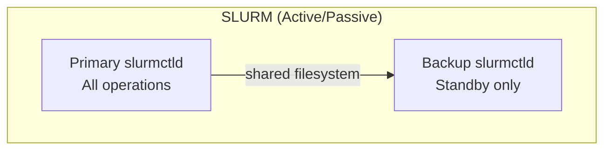
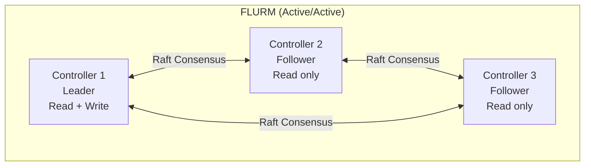
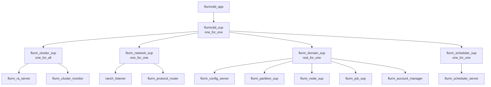

# SLURM vs FLURM: Differences Guide

This document outlines the key differences between SLURM and FLURM, serving as a reference for administrators and users migrating to or evaluating FLURM.

## Table of Contents

1. [Overview](#1-overview)
2. [Architectural Differences](#2-architectural-differences)
3. [Operational Differences](#3-operational-differences)
4. [Configuration Differences](#4-configuration-differences)
5. [Command Differences](#5-command-differences)
6. [Feature Parity Status](#6-feature-parity-status)
7. [Migration Considerations](#7-migration-considerations)

---

## 1. Overview

FLURM (Fault-tolerant Linux Utility for Resource Management) is a SLURM-compatible replacement designed for high availability, zero-downtime operations, and seamless horizontal scaling.

### Design Philosophy

| Aspect | SLURM | FLURM |
|--------|-------|-------|
| **Primary Goal** | Feature-rich HPC scheduler | Fault-tolerant, operationally simple scheduler |
| **Implementation** | C with threaded model | Erlang/OTP with actor model |
| **Protocol** | SLURM binary protocol | SLURM binary protocol (compatible) |
| **State Management** | Shared filesystem / MySQL | Raft consensus (Ra library) |

### What Stays the Same

- **All SLURM client tools work unchanged**: `sbatch`, `squeue`, `sinfo`, `scancel`, `srun`, `scontrol`, `sacctmgr`, `sacct`
- **Configuration file format**: Standard `slurm.conf` syntax is fully supported
- **Job scripts**: No modifications needed for existing batch scripts
- **MUNGE authentication**: Same authentication mechanism
- **Protocol compatibility**: SLURM protocol version 22.05/23.x compatible

### Key Benefits of FLURM

- **Zero-downtime upgrades** via Erlang hot code loading
- **Active-active controllers** instead of primary/backup
- **Sub-second failover** with Raft consensus
- **No global scheduler lock** (lock-free actor-based design)
- **Dynamic node scaling** without cluster restarts
- **Live configuration reload** for most settings

---

## 2. Architectural Differences

### 2.1 Controller Model

| Aspect | SLURM | FLURM |
|--------|-------|-------|
| **HA Model** | Primary/Backup (active/passive) | Active-active (all controllers can serve reads) |
| **Max Controllers** | 2 | Unlimited (odd number recommended for quorum) |
| **Failover Time** | 30-60 seconds | < 1 second |
| **State Sync** | Shared filesystem or MySQL | Raft consensus with in-memory state |

**SLURM Architecture:**



**FLURM Architecture:**



### 2.2 Implementation Stack

| Component | SLURM | FLURM |
|-----------|-------|-------|
| **Language** | C | Erlang/OTP |
| **Concurrency** | POSIX threads | Erlang processes (lightweight actors) |
| **Process Model** | Thread pool | Process per job/node/partition |
| **Memory Model** | Shared memory with locks | Message passing, no shared state |
| **Scheduling** | Global lock for scheduler decisions | Lock-free scheduling via message passing |

### 2.3 Consensus and State

| Aspect | SLURM | FLURM |
|--------|-------|-------|
| **State Storage** | Filesystem checkpoint + optional MySQL | Raft log + Mnesia |
| **Consensus Protocol** | None (filesystem-based) | Raft (via Ra library) |
| **Split-Brain Prevention** | Requires careful filesystem config | Built-in via Raft quorum |
| **State Recovery** | Read from checkpoint file | Replayed from Raft log |

### 2.4 Process Architecture

**FLURM Supervision Tree:**



Each job runs as its own Erlang process (gen_statem), enabling isolated failure handling and natural concurrency.

---

## 3. Operational Differences

### 3.1 Hot Code Reload

**SLURM:** Requires daemon restart for any code changes. This means:
- Draining nodes before upgrade
- Job queue disruption during restart
- Potential state loss if not checkpointed properly

**FLURM:** Supports Erlang hot code reload:
```bash
# Upgrade FLURM without restart
./bin/flurmctld upgrade

# Or via remote shell
erl -remsh flurm@controller1 -eval "flurm_upgrade:upgrade()."
```

This enables:
- Zero-downtime upgrades
- Live bug fixes
- No job queue disruption

### 3.2 Dynamic Node Management

**SLURM:** Adding/removing nodes typically requires:
```bash
# Edit slurm.conf to add new nodes
vim /etc/slurm/slurm.conf
# Then reconfigure (nodes already in config can be updated)
scontrol reconfigure
# For new nodes, often requires slurmctld restart
systemctl restart slurmctld
```

**FLURM:** Dynamic node add/remove:
```bash
# New nodes simply register themselves
# No controller restart needed
# Node daemon connects and is automatically discovered

# Or via scontrol (existing interface)
scontrol reconfigure
```

### 3.3 Configuration Hot Reload

| Setting Category | SLURM Reload | FLURM Reload |
|------------------|--------------|--------------|
| Partition definitions | Yes | Yes |
| Node weights/features | Yes | Yes |
| Scheduler parameters | Partial | Yes |
| Priority weights | Partial | Yes |
| New node definitions | Restart needed | Yes |
| Port changes | Restart needed | Restart needed |
| Authentication changes | Restart needed | Restart needed |

**FLURM extended reconfigure:**
```bash
# Full reconfigure from slurm.conf
scontrol reconfigure

# The following are reloadable in FLURM without restart:
# - SchedulerParameters
# - PriorityWeight* settings
# - Partition max/min settings
# - Node features and weights
# - QOS definitions
```

### 3.4 Scheduler Lock Behavior

**SLURM:** Uses global scheduler lock:
- Single thread performs scheduling decisions
- Can become bottleneck at scale (10,000+ jobs)
- Backfill scheduler holds lock during calculation

**FLURM:** Lock-free scheduling:
- Scheduler decisions use message passing
- No global lock contention
- Better scaling with large job queues

| Metric | SLURM | FLURM |
|--------|-------|-------|
| Job submission latency | ~1-10ms | < 1ms |
| Scheduler cycle (10K jobs) | ~100ms | ~10ms |
| Concurrent job submissions | Limited by lock | Parallel processing |

### 3.5 Failover Behavior

**SLURM Failover:**
1. Primary controller fails
2. Backup detects failure (30-120 second timeout)
3. Backup reads state from shared filesystem
4. Backup becomes primary
5. Clients timeout and retry
6. Total failover: 30-60 seconds

**FLURM Failover:**
1. Leader controller fails
2. Followers detect via Raft heartbeat (150-300ms)
3. Raft election selects new leader (< 500ms)
4. New leader already has current state
5. Clients automatically redirect
6. Total failover: < 1 second

---

## 4. Configuration Differences

### 4.1 Standard slurm.conf Settings

FLURM reads standard `slurm.conf` files. All common settings are supported:

```bash
# These work identically in FLURM
ClusterName=mycluster
SlurmctldHost=controller1
SlurmctldPort=6817
SlurmdPort=6818
AuthType=auth/munge
SchedulerType=sched/backfill
SelectType=select/cons_tres

# Node definitions
NodeName=node[001-100] CPUs=64 RealMemory=128000

# Partition definitions
PartitionName=batch Nodes=node[001-050] Default=YES
PartitionName=gpu Nodes=node[051-100] MaxTime=24:00:00
```

### 4.2 FLURM-Specific Settings

FLURM introduces additional configuration via environment variables:

| Variable | Description | Default |
|----------|-------------|---------|
| `FLURM_NODE_NAME` | Erlang node name for clustering | `flurm@localhost` |
| `FLURM_COOKIE` | Erlang cookie for cluster authentication | `flurm_secret` |
| `FLURM_CLUSTER_NODES` | Comma-separated list of cluster nodes | (none) |
| `FLURM_RA_DATA_DIR` | Directory for Raft data | `/var/lib/flurm/ra` |
| `FLURM_CONFIG_FILE` | Path to slurm.conf | `/etc/slurm/slurm.conf` |

**Example HA configuration:**
```bash
# /etc/flurm/flurm.conf (sourced by systemd)
FLURM_NODE_NAME=flurm@ctrl1.example.com
FLURM_COOKIE=your_secret_cookie_here
FLURM_CLUSTER_NODES=flurm@ctrl1.example.com,flurm@ctrl2.example.com,flurm@ctrl3.example.com
FLURM_RA_DATA_DIR=/var/lib/flurm/ra
```

### 4.3 Settings That Behave Differently

| Setting | SLURM Behavior | FLURM Behavior |
|---------|----------------|----------------|
| `SlurmctldHost` | Primary, with optional backup | All listed hosts are active controllers |
| `StateSaveLocation` | Checkpoint file location | Raft data directory (uses FLURM_RA_DATA_DIR) |
| `SchedulerParameters` | Some require restart | All reloadable via scontrol reconfigure |
| `ReturnToService` | Node state after reboot | Same, but automatic via registration |

### 4.4 Settings Not Yet Implemented

The following slurm.conf settings are parsed but not yet fully implemented:

| Setting | Status | Notes |
|---------|--------|-------|
| `FederationParameters` | Partial | Federation module exists but not production-ready |
| `TopologyPlugin` | Stub | Returns empty topology |
| `BurstBufferType` | Implemented | Basic burst buffer support available |
| `PowerSaveBeginTime` | Not implemented | Power management planned |
| `SuspendTime` | Not implemented | Node suspend planned |
| `ResumeProgram` | Not implemented | Node resume planned |

---

## 5. Command Differences

### 5.1 Fully Compatible Commands

These commands work identically with FLURM:

| Command | Function | Compatibility |
|---------|----------|---------------|
| `sbatch` | Submit batch jobs | Full |
| `squeue` | View job queue | Full |
| `scancel` | Cancel jobs | Full |
| `sinfo` | View node/partition info | Full |
| `scontrol show job` | Job details | Full |
| `scontrol show node` | Node details | Full |
| `scontrol show partition` | Partition details | Full |
| `scontrol reconfigure` | Hot reload config | Full (enhanced in FLURM) |
| `scontrol show config` | View configuration | Full |
| `sdiag` | Scheduler diagnostics | Full |

### 5.2 Commands with Partial Support

| Command | Supported Functions | Not Yet Supported |
|---------|---------------------|-------------------|
| `srun` | Basic interactive jobs | I/O forwarding, PMI |
| `scontrol update job` | Priority, time limit, hold/release | All fields |
| `scontrol update node` | State changes | Weight, features |
| `sacctmgr` | Accounts, users, QOS | Federations, WCKeys |
| `sacct` | Job history queries | All format options |

### 5.3 Additional FLURM Commands

FLURM provides additional administrative capabilities:

```bash
# View cluster status (FLURM-specific)
curl http://controller:8080/api/cluster/status

# Prometheus metrics endpoint
curl http://controller:9090/metrics

# Live Erlang shell for debugging
./bin/flurmctld remote_console
```

### 5.4 scontrol Subcommand Support

| Subcommand | Status | Notes |
|------------|--------|-------|
| `show job` | Full | All job fields returned |
| `show node` | Full | All node fields returned |
| `show partition` | Full | All partition fields returned |
| `show reservation` | Full | Reservation management supported |
| `show license` | Full | License tracking supported |
| `show topology` | Stub | Returns empty (no topology plugin) |
| `show burstbuffer` | Full | Burst buffer info supported |
| `show frontend` | Stub | Returns empty (no front-end nodes) |
| `reconfigure` | Full | Enhanced hot reload |
| `shutdown` | Full | Graceful shutdown |
| `update job` | Partial | Priority, time limit, hold/release |
| `update node` | Partial | State changes |
| `create reservation` | Full | |
| `update reservation` | Full | |
| `delete reservation` | Full | |

### 5.5 sacctmgr Subcommand Support

| Subcommand | Status | Notes |
|------------|--------|-------|
| `show account` | Full | |
| `add account` | Full | |
| `modify account` | Full | |
| `delete account` | Full | |
| `show user` | Full | |
| `add user` | Full | |
| `modify user` | Full | |
| `delete user` | Full | |
| `show qos` | Full | |
| `add qos` | Full | |
| `modify qos` | Full | |
| `delete qos` | Full | |
| `show association` | Full | |
| `show cluster` | Full | |
| `show federation` | Partial | Basic federation support |
| `show tres` | Full | |

---

## 6. Feature Parity Status

### 6.1 Features Fully Compatible

| Feature | Notes |
|---------|-------|
| Batch job submission | sbatch fully supported |
| Job cancellation | scancel fully supported |
| Job/node/partition queries | squeue, sinfo, scontrol show |
| MUNGE authentication | Standard auth/munge plugin |
| Partitions | Full partition configuration |
| Node registration | Dynamic node registration |
| Job priorities | Multi-factor priority supported |
| Fair-share scheduling | flurm_fairshare module |
| Backfill scheduling | flurm_backfill module |
| Job arrays | Full array syntax support (--array=0-100%10) |
| Job dependencies | afterok, afterany, afternotok, singleton |
| Reservations | Create, update, delete reservations |
| Licenses | License tracking and allocation |
| QOS | Quality of Service management |
| Accounting | Job accounting via slurmdbd compatible API |
| GRES (Generic Resources) | GPU scheduling supported |
| Job steps | Step creation and tracking |

### 6.2 Features with Differences

| Feature | Difference |
|---------|------------|
| **Controller HA** | Active-active vs active-passive |
| **Failover time** | < 1 second vs 30-60 seconds |
| **Config reload** | More settings reloadable |
| **Scaling** | Lock-free scheduler scales better |
| **Upgrades** | Hot code reload supported |

### 6.3 Features Not Yet Implemented

| Feature | Status | Timeline |
|---------|--------|----------|
| **Federation** | Module exists, not production-ready | Planned |
| **Heterogeneous jobs** | Not implemented | Planned |
| **Power management** | Not implemented | Planned |
| **Cray/Shasta support** | Not implemented | Not planned |
| **PMI/PMIx** | Basic support only | Improving |
| **srun I/O forwarding** | Not implemented | Planned |
| **Job profiling** | Not implemented | Planned |
| **Burst buffer (DataWarp)** | Basic support | Expanding |
| **Topology-aware scheduling** | Stub only | Planned |
| **SPANK plugins** | Not compatible | Different plugin model |

### 6.4 Feature Comparison Matrix

| Feature | SLURM | FLURM |
|---------|:-----:|:-----:|
| Batch job submission | Yes | Yes |
| Interactive jobs (srun) | Yes | Partial |
| Job arrays | Yes | Yes |
| Job dependencies | Yes | Yes |
| Fair-share scheduling | Yes | Yes |
| Backfill scheduling | Yes | Yes |
| Preemption | Yes | Yes |
| QOS | Yes | Yes |
| Reservations | Yes | Yes |
| GRES/GPU scheduling | Yes | Yes |
| Accounting | Yes | Yes |
| Federation | Yes | Partial |
| Heterogeneous jobs | Yes | No |
| Power management | Yes | No |
| **Hot code reload** | No | **Yes** |
| **Active-active HA** | No | **Yes** |
| **Sub-second failover** | No | **Yes** |
| **Lock-free scheduler** | No | **Yes** |
| **Dynamic node scaling** | Limited | **Yes** |

---

## 7. Migration Considerations

### 7.1 What Works Out of the Box

- **Job scripts**: No changes needed
- **slurm.conf**: Standard configurations work
- **MUNGE**: Same authentication
- **Client commands**: sbatch, squeue, scancel, sinfo all work
- **Node definitions**: Same syntax
- **Partition definitions**: Same syntax
- **Basic scheduling**: FIFO, backfill, fair-share

### 7.2 What Needs Adjustment

| Item | Adjustment Needed |
|------|-------------------|
| **HA configuration** | Change from primary/backup to Raft cluster |
| **State storage** | Move from filesystem checkpoint to Raft |
| **Controller hosts** | Update SlurmctldHost for multiple active controllers |
| **Environment** | Add FLURM_* environment variables for clustering |
| **Monitoring** | Update to use Prometheus endpoints |
| **slurmdbd** | Use FLURM's slurmdbd or keep existing |

### 7.3 Known Incompatibilities

| Area | Incompatibility | Workaround |
|------|-----------------|------------|
| **SPANK plugins** | Not supported | Use FLURM's plugin hooks |
| **srun --pty** | Not fully supported | Use sbatch for now |
| **PMIx** | Basic support only | MPI jobs may need adjustment |
| **Topology plugins** | Not implemented | Flat topology assumed |
| **Power plugins** | Not implemented | Manual power management |
| **Checkpoint/restart** | Different mechanism | Use application-level checkpointing |

### 7.4 Migration Checklist

Pre-Migration:
- [ ] All running jobs completed or checkpointed
- [ ] SLURM state backed up
- [ ] MUNGE working on all nodes
- [ ] Erlang/OTP installed on controller and compute nodes
- [ ] FLURM binaries built and deployed
- [ ] Firewall ports opened (6817, 6818, 4369, 9100-9110)
- [ ] DNS/hostnames correct for all nodes

Migration Steps:
1. Stop SLURM daemons (slurmctld, slurmd)
2. Deploy FLURM configuration
3. Start FLURM controllers
4. Start FLURM node daemons
5. Verify node registration (sinfo)
6. Submit test job (sbatch)
7. Verify job execution

Rollback:
- Stop FLURM daemons
- Restore SLURM state backup
- Start SLURM daemons

See [MIGRATION.md](MIGRATION.md) for detailed step-by-step instructions.

### 7.5 Performance Expectations

| Metric | SLURM | FLURM | Notes |
|--------|-------|-------|-------|
| Job submission latency | ~1-10ms | < 1ms | Lock-free design |
| Scheduler decision | ~100ms | ~10ms | Actor-based |
| Protocol encode | ~100us | < 50us | Optimized codec |
| Raft commit | N/A | < 10ms | Consensus overhead |
| Failover time | 30-60s | < 1s | Raft election |

### 7.6 Support Resources

- GitHub Issues: https://github.com/your-org/flurm/issues
- Documentation: See docs/ directory
- Architecture: [ARCHITECTURE.md](ARCHITECTURE.md)
- Migration: [MIGRATION.md](MIGRATION.md)

---

## Appendix: Quick Reference

### SLURM to FLURM Daemon Mapping

| SLURM Daemon | FLURM Equivalent | Notes |
|--------------|------------------|-------|
| `slurmctld` | `flurmctld` | Erlang-based controller |
| `slurmd` | `flurmnd` | Erlang-based node daemon |
| `slurmdbd` | `flurmdbd` | Accounting daemon |

### Environment Variables

| Variable | Purpose | Example |
|----------|---------|---------|
| `FLURM_NODE_NAME` | Erlang node name | `flurm@ctrl1.example.com` |
| `FLURM_COOKIE` | Cluster authentication | `my_secret_cookie` |
| `FLURM_CLUSTER_NODES` | Cluster members | `flurm@ctrl1,flurm@ctrl2,flurm@ctrl3` |
| `FLURM_RA_DATA_DIR` | Raft data directory | `/var/lib/flurm/ra` |
| `FLURM_CONFIG_FILE` | Config file path | `/etc/slurm/slurm.conf` |
| `FLURM_CONTROLLER_HOST` | Controller for node daemon | `ctrl1.example.com` |
| `FLURM_CONTROLLER_PORT` | Controller port | `6818` |

### Ports

| Port | Service | Protocol |
|------|---------|----------|
| 6817 | Controller (slurmctld) | SLURM protocol |
| 6818 | Node daemon (slurmd) | SLURM protocol |
| 6819 | Accounting (slurmdbd) | SLURM protocol |
| 4369 | EPMD (Erlang) | Erlang distribution |
| 9100-9110 | Erlang distribution | Inter-controller |
| 8080 | FLURM API (optional) | HTTP/REST |
| 9090 | Prometheus metrics | HTTP |
