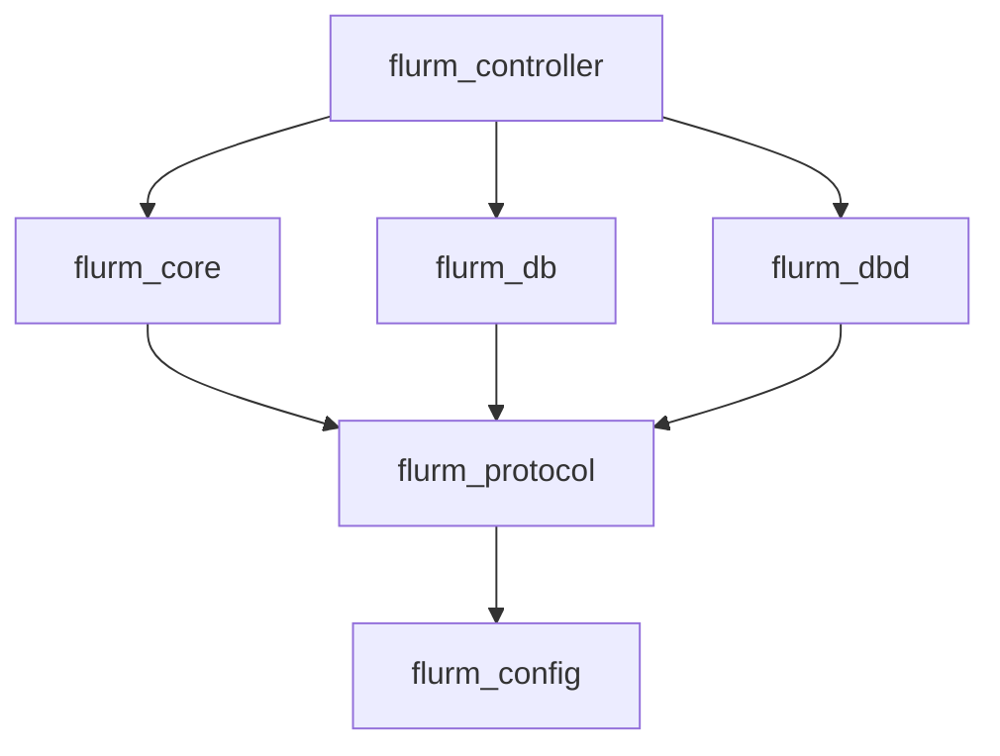
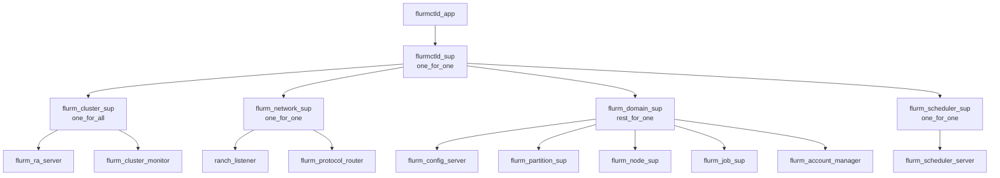
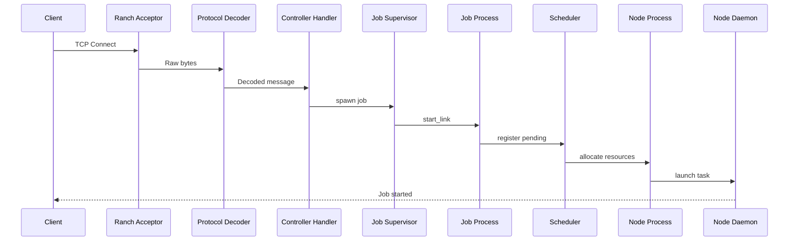
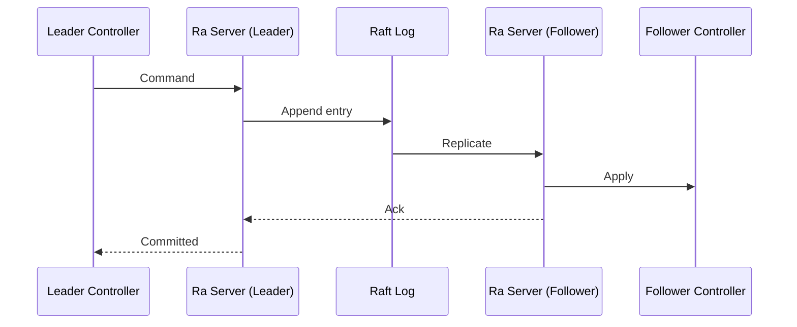
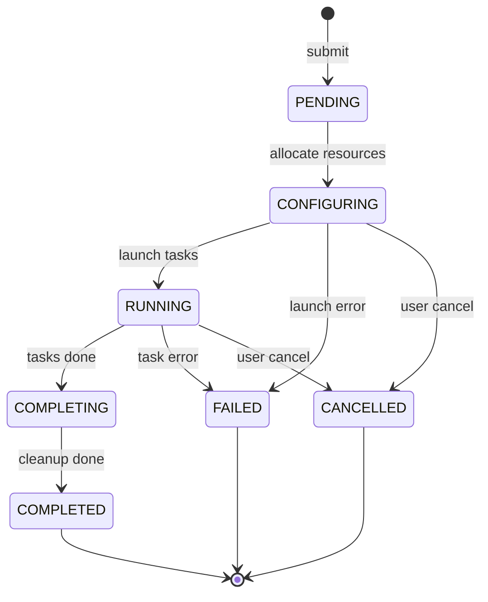
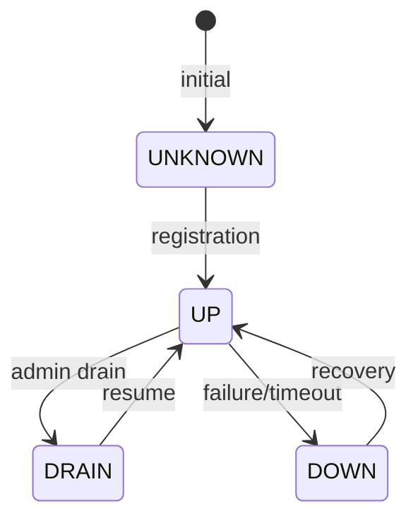
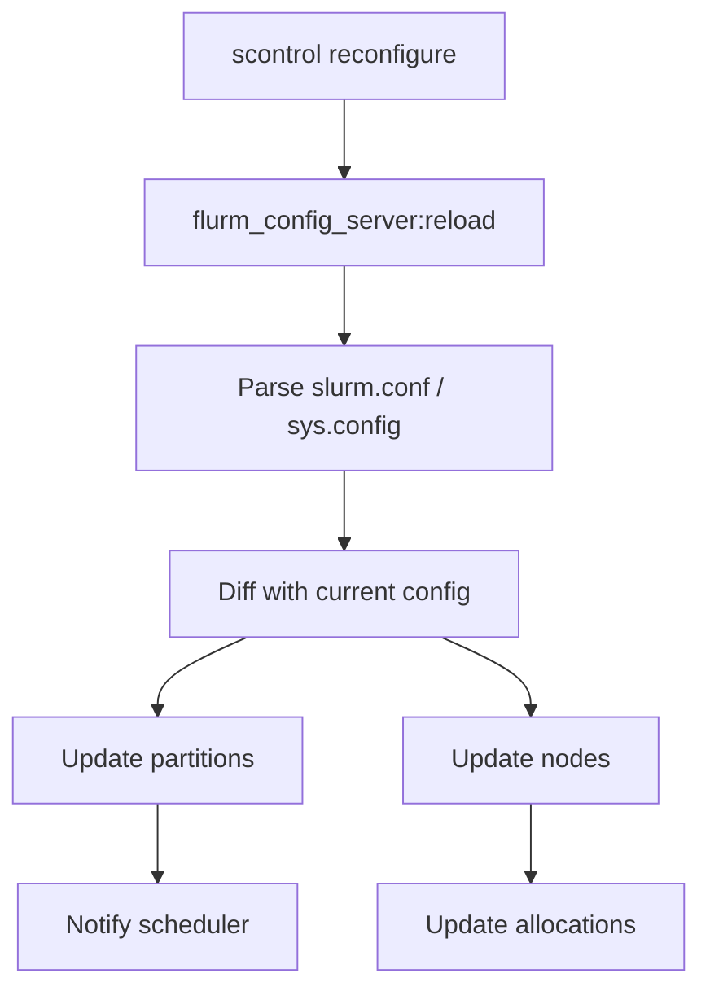
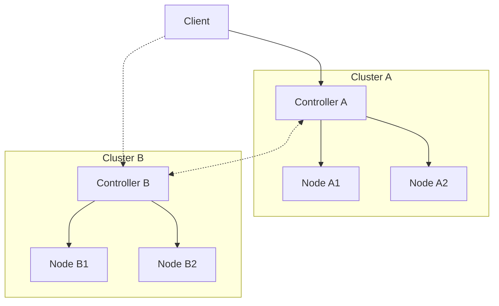
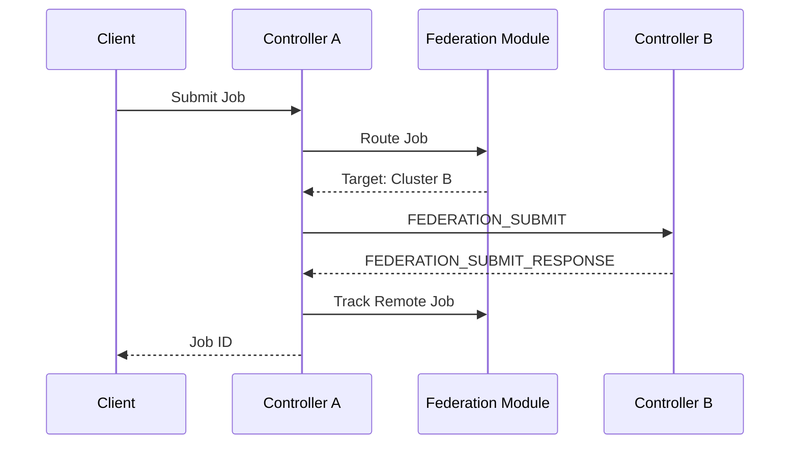

# FLURM Architecture

This document describes the internal architecture of FLURM.

## Overview

FLURM is built as an Erlang/OTP umbrella application with the following apps:

| App | Description |
|-----|-------------|
| `flurm_protocol` | SLURM binary protocol codec |
| `flurm_core` | Domain logic (jobs, nodes, scheduling) |
| `flurm_controller` | Controller daemon (slurmctld equivalent) |
| `flurm_node_daemon` | Node daemon (slurmd equivalent) |
| `flurm_dbd` | Accounting daemon (slurmdbd equivalent) |
| `flurm_db` | Persistence layer (Raft + Mnesia) |
| `flurm_config` | Configuration management |

## Application Dependencies



## Core Components

### flurm_protocol

Handles SLURM binary protocol encoding/decoding:

- **flurm_protocol_codec** - Main codec for all message types
- **Message types supported**:
  - Job operations (4001-4029)
  - Node operations (1001-1029)
  - Information queries (2001-2058)
  - Job steps (5001-5041)
  - Accounting (various)

### flurm_core

Core domain logic:

- **flurm_job** - Job state machine (gen_statem)
  - States: pending → configuring → running → completing → completed/failed/cancelled
  - Handles job lifecycle transitions

- **flurm_scheduler** - Scheduling engine
  - FIFO and backfill scheduling
  - Priority-based ordering
  - Fair-share calculations

- **flurm_node** - Node process (gen_server)
  - Resource tracking
  - Heartbeat handling
  - Job slot allocation

- **flurm_account_manager** - Accounting entity management
  - Accounts, users, associations
  - QOS and TRES tracking

### flurm_controller

Controller daemon implementation:

- **flurm_controller_acceptor** - Ranch TCP acceptor
- **flurm_controller_handler** - RPC request handler
- **flurm_controller_cluster** - Multi-controller coordination
- **flurm_controller_failover** - HA failover handler
- **flurm_federation** - Cross-cluster federation (~1,400 lines)
- **flurm_federation_api** - REST API for federation management

### flurm_db

Persistence and consensus:

- **flurm_db_raft** - Ra (Raft) state machine
- **flurm_db_mnesia** - Mnesia backend for distributed storage

### flurm_dbd

Accounting daemon:

- **flurm_dbd_server** - Main accounting server
- **flurm_dbd_storage** - Storage backend (ETS/Mnesia)
- **flurm_dbd_acceptor** - TCP connection handler

## Process Architecture

### Controller Supervision Tree



## Message Flow

### Job Submission



### Consensus Replication



## State Management

### Job States



### Node States



## Configuration Hot Reload



## Federation

FLURM supports cross-cluster federation for job routing and resource aggregation across multiple FLURM clusters.

> **Note**: Federation currently only works **FLURM to FLURM**. It does not support federating with native SLURM clusters. SLURM has its own federation mechanism ("sibling clusters") that uses different protocols and data structures.

### Federation Architecture



### Federation Components

| Module | Description |
|--------|-------------|
| `flurm_federation` | Core federation logic, routing, health monitoring |
| `flurm_federation_api` | REST API for federation management |
| `flurm_controller_handler` | Federation-aware job submission |

### Federation Features

- **Cluster Registration** - Add/remove clusters dynamically
- **Job Routing** - Route jobs to optimal cluster based on policy
  - Round-robin
  - Least-loaded
  - Weighted
  - Partition affinity
- **Remote Job Tracking** - Track jobs submitted to remote clusters
- **Resource Aggregation** - Query resources across all clusters
- **Health Monitoring** - 10-second health checks with failure tracking

### Federation REST API

| Endpoint | Method | Description |
|----------|--------|-------------|
| `/api/v1/federation` | GET | Federation info |
| `/api/v1/federation/clusters` | GET | List clusters |
| `/api/v1/federation/clusters` | POST | Add cluster |
| `/api/v1/federation/clusters/:name` | DELETE | Remove cluster |
| `/api/v1/federation/resources` | GET | Aggregate resources |
| `/api/v1/federation/jobs` | POST | Submit federated job |

### Federation Protocol Messages

| Type ID | Name | Description |
|---------|------|-------------|
| 2024 | `REQUEST_FED_INFO` | Federation info request |
| 2025 | `RESPONSE_FED_INFO` | Federation info response |
| 2032 | `REQUEST_FEDERATION_SUBMIT` | Cross-cluster job submission |
| 2033 | `RESPONSE_FEDERATION_SUBMIT` | Cross-cluster job response |
| 2034 | `REQUEST_FEDERATION_JOB_STATUS` | Remote job status query |
| 2035 | `RESPONSE_FEDERATION_JOB_STATUS` | Remote job status response |
| 2036 | `REQUEST_FEDERATION_JOB_CANCEL` | Remote job cancellation |
| 2037 | `RESPONSE_FEDERATION_JOB_CANCEL` | Remote cancel response |

### Job Routing Flow



## Fault Tolerance

### Controller Failover

1. Leader heartbeats to followers
2. Followers detect timeout
3. New leader election via Raft
4. Leader takes over job scheduling
5. Clients reconnect automatically

### Node Failure Handling

1. Node misses heartbeats
2. Controller marks node DOWN
3. Jobs on node marked FAILED
4. Jobs eligible for requeue
5. Resources deallocated

### Split-Brain Prevention

Ra (Raft) ensures only one leader can exist:
- Majority quorum required for commits
- Old leader cannot commit after partition
- State converges when partition heals

## Performance Characteristics

| Operation | Latency | Throughput |
|-----------|---------|------------|
| Job submission | < 1ms | 50,000/sec |
| Scheduler decision | < 100us | 10,000/sec |
| Protocol encode | < 50us | 100,000/sec |
| Raft commit | < 10ms | 1,000/sec |
| Failover | < 1 sec | N/A |

## Resource Management

### Memory

- Each job process: ~10KB
- Each node process: ~5KB
- ETS tables: Proportional to cluster size
- Raft log: Configurable, typically < 100MB

### CPU

- Protocol codec: CPU-bound during high throughput
- Scheduler: Periodic bursts during scheduling cycles
- Raft: Low CPU, mostly I/O wait

## Observability

### Prometheus Metrics

FLURM exposes metrics in Prometheus format at `/metrics` (port 6820 by default).

#### Job Metrics

| Metric | Type | Description |
|--------|------|-------------|
| `flurm_jobs_submitted_total` | counter | Total jobs submitted |
| `flurm_jobs_completed_total` | counter | Jobs completed successfully |
| `flurm_jobs_failed_total` | counter | Jobs that failed |
| `flurm_jobs_pending` | gauge | Current pending jobs |
| `flurm_jobs_running` | gauge | Current running jobs |

#### Node Metrics

| Metric | Type | Description |
|--------|------|-------------|
| `flurm_nodes_total` | gauge | Total nodes |
| `flurm_nodes_up` | gauge | Nodes in up state |
| `flurm_nodes_down` | gauge | Nodes in down state |
| `flurm_cpus_total` | gauge | Total CPUs in cluster |
| `flurm_cpus_allocated` | gauge | CPUs allocated to jobs |

#### Federation Metrics

| Metric | Type | Description |
|--------|------|-------------|
| `flurm_federation_clusters_total` | gauge | Total federated clusters |
| `flurm_federation_clusters_healthy` | gauge | Healthy clusters |
| `flurm_federation_clusters_unhealthy` | gauge | Unhealthy clusters |
| `flurm_federation_jobs_submitted_total` | counter | Jobs submitted to remote clusters |
| `flurm_federation_routing_decisions_total` | counter | Routing decisions made |
| `flurm_federation_routing_local_total` | counter | Jobs routed locally |
| `flurm_federation_routing_remote_total` | counter | Jobs routed to remote clusters |
| `flurm_federation_health_checks_total` | counter | Health checks performed |
| `flurm_federation_routing_duration_ms` | histogram | Routing decision latency |
| `flurm_federation_remote_submit_duration_ms` | histogram | Remote submission latency |

#### Scheduler Metrics

| Metric | Type | Description |
|--------|------|-------------|
| `flurm_scheduler_cycles_total` | counter | Scheduler cycles |
| `flurm_scheduler_duration_ms` | histogram | Scheduler cycle duration |
| `flurm_scheduler_backfill_jobs` | counter | Jobs scheduled via backfill |

#### TRES (Trackable Resources) Metrics

TRES metrics use Prometheus labels to support dynamic resource types. This allows tracking CPUs, memory, GPUs, and custom GRES types with a single metric family.

| Metric | Labels | Type | Description |
|--------|--------|------|-------------|
| `flurm_tres_total` | `type` | gauge | Total resources in cluster |
| `flurm_tres_allocated` | `type` | gauge | Resources allocated to jobs |
| `flurm_tres_idle` | `type` | gauge | Available resources (total - allocated) |
| `flurm_tres_configured` | `type`, `name` | gauge | Configured TRES types (1 = configured) |

**Standard TRES types:**
- `cpu` - CPU cores
- `mem` - Memory (MB)
- `gpu` - GPU devices
- `node` - Compute nodes
- `energy` - Energy consumption

**Example Prometheus output:**
```
flurm_tres_total{type="cpu"} 256
flurm_tres_allocated{type="cpu"} 128
flurm_tres_idle{type="cpu"} 128
flurm_tres_total{type="gpu"} 16
flurm_tres_allocated{type="gpu"} 8
flurm_tres_idle{type="gpu"} 8
flurm_tres_configured{type="gres/gpu",name="a100"} 1
```
