# FLURM Architecture

This document describes the internal architecture of FLURM.

## Overview

FLURM is built as an Erlang/OTP umbrella application with the following apps:

| App | Description |
|-----|-------------|
| `flurm_protocol` | SLURM binary protocol codec |
| `flurm_core` | Domain logic (jobs, nodes, scheduling) |
| `flurm_controller` | Controller daemon (slurmctld equivalent) |
| `flurm_node_daemon` | Node daemon (slurmd equivalent) |
| `flurm_dbd` | Accounting daemon (slurmdbd equivalent) |
| `flurm_db` | Persistence layer (Raft + Mnesia) |
| `flurm_config` | Configuration management |

## Application Dependencies

## Core Components

### flurm_protocol

Handles SLURM binary protocol encoding/decoding:

- **flurm_protocol_codec** - Main codec for all message types
- **Message types supported**:
  - Job operations (4001-4029)
  - Node operations (1001-1029)
  - Information queries (2001-2058)
  - Job steps (5001-5041)
  - Accounting (various)

### flurm_core

Core domain logic:

- **flurm_job** - Job state machine (gen_statem)
  - States: pending → configuring → running → completing → completed/failed/cancelled
  - Handles job lifecycle transitions

- **flurm_scheduler** - Scheduling engine
  - FIFO and backfill scheduling
  - Priority-based ordering
  - Fair-share calculations

- **flurm_node** - Node process (gen_server)
  - Resource tracking
  - Heartbeat handling
  - Job slot allocation

- **flurm_account_manager** - Accounting entity management
  - Accounts, users, associations
  - QOS and TRES tracking

### flurm_controller

Controller daemon implementation:

- **flurm_controller_acceptor** - Ranch TCP acceptor
- **flurm_controller_handler** - RPC request handler
- **flurm_controller_cluster** - Multi-controller coordination

### flurm_db

Persistence and consensus:

- **flurm_db_raft** - Ra (Raft) state machine
- **flurm_db_mnesia** - Mnesia backend for distributed storage

### flurm_dbd

Accounting daemon:

- **flurm_dbd_server** - Main accounting server
- **flurm_dbd_storage** - Storage backend (ETS/Mnesia)
- **flurm_dbd_acceptor** - TCP connection handler

## Process Architecture

### Controller Supervision Tree

## Message Flow

### Job Submission

### Consensus Replication

## State Management

### Job States

```mermaid
stateDiagram-v2
    [*] --> PENDING: submit
    PENDING --> CONFIGURING: allocate resources
    CONFIGURING --> RUNNING: launch tasks
    CONFIGURING --> FAILED: launch error
    CONFIGURING --> CANCELLED: user cancel
    RUNNING --> COMPLETING: tasks done
    RUNNING --> FAILED: task error
    RUNNING --> CANCELLED: user cancel
    COMPLETING --> COMPLETED: cleanup done
    COMPLETED --> [*]
    FAILED --> [*]
    CANCELLED --> [*]
```

### Node States

## Configuration Hot Reload

## Fault Tolerance

### Controller Failover

1. Leader heartbeats to followers
2. Followers detect timeout
3. New leader election via Raft
4. Leader takes over job scheduling
5. Clients reconnect automatically

### Node Failure Handling

1. Node misses heartbeats
2. Controller marks node DOWN
3. Jobs on node marked FAILED
4. Jobs eligible for requeue
5. Resources deallocated

### Split-Brain Prevention

Ra (Raft) ensures only one leader can exist:
- Majority quorum required for commits
- Old leader cannot commit after partition
- State converges when partition heals

## Performance Characteristics

| Operation | Latency | Throughput |
|-----------|---------|------------|
| Job submission | < 1ms | 50,000/sec |
| Scheduler decision | < 100us | 10,000/sec |
| Protocol encode | < 50us | 100,000/sec |
| Raft commit | < 10ms | 1,000/sec |
| Failover | < 1 sec | N/A |

## Resource Management

### Memory

- Each job process: ~10KB
- Each node process: ~5KB
- ETS tables: Proportional to cluster size
- Raft log: Configurable, typically < 100MB

### CPU

- Protocol codec: CPU-bound during high throughput
- Scheduler: Periodic bursts during scheduling cycles
- Raft: Low CPU, mostly I/O wait
