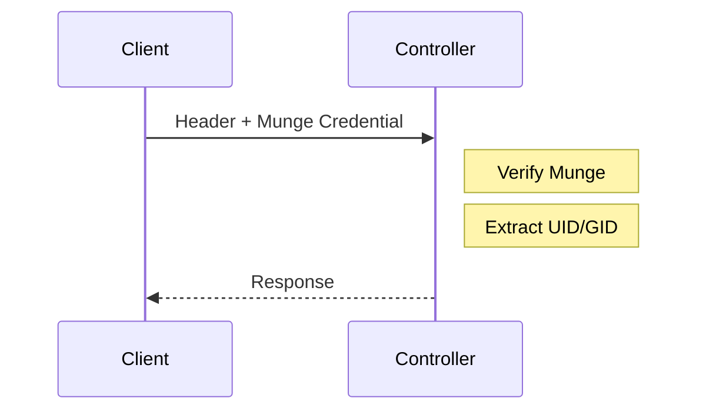

# FLURM Protocol Reference

This document describes the SLURM binary protocol as implemented by FLURM, including message formats, type definitions, and Erlang pattern matching examples.

## Table of Contents

1. [Overview](#overview)
2. [Wire Format](#wire-format)
3. [Message Types](#message-types)
4. [Data Types](#data-types)
5. [Erlang Pattern Matching](#erlang-pattern-matching)
6. [Protocol Versioning](#protocol-versioning)
7. [Authentication](#authentication)
8. [Error Handling](#error-handling)

## Overview

SLURM uses a custom binary protocol over TCP for communication between:
- Clients (sbatch, squeue, etc.) and Controllers (slurmctld)
- Controllers and Compute Daemons (slurmd)
- Controller to Controller (federation)

FLURM implements this protocol for full compatibility with SLURM clients and daemons.

## Wire Format

### Message Header

Every SLURM message begins with a fixed-size header (24 bytes):

| Offset | Size | Field | Encoding |
|--------|------|-------|----------|
| 0 | 2 bytes | Protocol Version | uint16, big-endian |
| 2 | 2 bytes | Flags | uint16, big-endian |
| 4 | 2 bytes | Message Type | uint16, big-endian |
| 6 | 2 bytes | Reserved | - |
| 8 | 4 bytes | Body Length | uint32, big-endian |
| 12 | 4 bytes | Forward Count | uint32, big-endian |
| 16 | 4 bytes | Return Code | uint32, big-endian |
| 20 | 4 bytes | Message ID | uint32, big-endian |

### Message Body

The body follows immediately after the header and is `Body Length` bytes. Content is type-specific (see Message Types section).

### Header Flags

| Bit | Name | Description |
|-----|------|-------------|
| 0 | `SLURM_PROTOCOL_MUNGE_AUTH` | Message is Munge authenticated |
| 1 | `SLURM_PROTOCOL_AUTH_NONE` | No authentication |
| 2 | `SLURM_PROTOCOL_FORWARD` | Message should be forwarded |
| 3 | `SLURM_PROTOCOL_RESP` | This is a response message |
| 4-15 | Reserved | Future use |

## Message Types

### Request Messages (Client to Controller)

| Type ID | Name | Description |
|---------|------|-------------|
| 1001 | `REQUEST_NODE_INFO` | Get information about nodes |
| 1002 | `REQUEST_NODE_INFO_SINGLE` | Get info for single node |
| 1003 | `REQUEST_PARTITION_INFO` | Get partition information |
| 1004 | `REQUEST_JOB_INFO` | Get job information |
| 1005 | `REQUEST_JOB_INFO_SINGLE` | Get info for single job |
| 2001 | `REQUEST_SUBMIT_BATCH_JOB` | Submit a batch job |
| 2002 | `REQUEST_JOB_WILL_RUN` | Check if job will run |
| 2003 | `REQUEST_CANCEL_JOB` | Cancel a job |
| 2004 | `REQUEST_UPDATE_JOB` | Modify job parameters |
| 2005 | `REQUEST_JOB_STEP_CREATE` | Create a job step |
| 2006 | `REQUEST_JOB_ATTACH` | Attach to running job |
| 3001 | `REQUEST_RECONFIGURE` | Reconfigure controller |
| 3002 | `REQUEST_SHUTDOWN` | Shutdown controller |
| 3003 | `REQUEST_PING` | Health check |

### Response Messages (Controller to Client)

| Type ID | Name | Description |
|---------|------|-------------|
| 4001 | `RESPONSE_NODE_INFO` | Node information response |
| 4002 | `RESPONSE_PARTITION_INFO` | Partition info response |
| 4003 | `RESPONSE_JOB_INFO` | Job information response |
| 5001 | `RESPONSE_SUBMIT_BATCH_JOB` | Job submission result |
| 5002 | `RESPONSE_JOB_WILL_RUN` | Will run prediction |
| 5003 | `RESPONSE_SLURM_RC` | Generic return code |
| 6001 | `RESPONSE_PING` | Ping response |

### Controller-Daemon Messages

| Type ID | Name | Description |
|---------|------|-------------|
| 7001 | `REQUEST_LAUNCH_TASKS` | Launch job tasks |
| 7002 | `REQUEST_SIGNAL_TASKS` | Send signal to tasks |
| 7003 | `REQUEST_TERMINATE_TASKS` | Terminate tasks |
| 7004 | `REQUEST_KILL_JOB` | Kill entire job |
| 8001 | `MESSAGE_NODE_REGISTRATION` | Node registration |
| 8002 | `MESSAGE_PING` | Node heartbeat |
| 8003 | `MESSAGE_EPILOG_COMPLETE` | Job epilog finished |

## Data Types

### Primitive Types

```erlang
%% Integer types (all big-endian)
-type uint8()  :: 0..255.
-type uint16() :: 0..65535.
-type uint32() :: 0..4294967295.
-type uint64() :: 0..18446744073709551615.
-type int32()  :: -2147483648..2147483647.
-type int64()  :: -9223372036854775808..9223372036854775807.
```

### String Encoding

Strings are length-prefixed: `[Length: u32][UTF-8 Data: Length bytes]`

If the string is null/empty, Length = `0xFFFFFFFF` (NO_VAL marker).

### Array Encoding

Arrays are count-prefixed: `[Count: u32][Elements: Count * element_size]`

### Job Submission Message

**REQUEST_SUBMIT_BATCH_JOB Body:**

| Field | Type | Description |
|-------|------|-------------|
| account | string | Account name |
| batch_features | string | Batch features |
| container | string | Container image |
| contiguous | uint16 | Contiguous nodes required |
| cpus_per_task | uint16 | CPUs per task |
| dependency | string | Job dependencies |
| environment | string[] | Environment variables |
| job_id | uint32 | Requested job ID (0 = any) |
| job_name | string | Job name |
| licenses | string | Required licenses |
| mail_type | uint16 | Mail notification flags |
| mail_user | string | Mail recipient |
| max_cpus | uint32 | Maximum CPUs |
| max_nodes | uint32 | Maximum nodes |
| mem_per_cpu | uint64 | Memory per CPU (MB) |
| min_cpus | uint32 | Minimum CPUs |
| min_nodes | uint32 | Minimum nodes |
| name | string | Job name |
| num_tasks | uint32 | Number of tasks |
| partition | string | Partition name |
| priority | uint32 | Job priority |
| qos | string | Quality of service |
| script | string | Job script content |
| std_err | string | Stderr path |
| std_in | string | Stdin path |
| std_out | string | Stdout path |
| time_limit | uint32 | Time limit (minutes) |
| user_id | uint32 | Submitting user ID |
| group_id | uint32 | Submitting group ID |
| work_dir | string | Working directory |

### Node Information Message

**RESPONSE_NODE_INFO Body:**

| Field | Type | Description |
|-------|------|-------------|
| record_count | uint32 | Number of node records |
| last_update | uint64 | Timestamp of last update |
| nodes[] | node_info[] | Array of node info structures |

**node_info structure:**

| Field | Type | Description |
|-------|------|-------------|
| arch | string | Architecture |
| boards | uint16 | Number of boards |
| boot_time | uint64 | Boot timestamp |
| cores | uint16 | Cores per socket |
| cpu_load | uint32 | CPU load * 100 |
| cpus | uint16 | Total CPUs |
| features | string | Node features |
| free_mem | uint64 | Free memory (MB) |
| gres | string | Generic resources |
| name | string | Node name |
| node_state | uint32 | Node state flags |
| os | string | Operating system |
| partitions | string | Partition membership |
| real_memory | uint64 | Total memory (MB) |
| sockets | uint16 | Number of sockets |
| threads | uint16 | Threads per core |
| tmp_disk | uint32 | Temp disk space (MB) |
| weight | uint32 | Scheduling weight |

## Erlang Pattern Matching

### Header Decoding

```erlang
-module(flurm_protocol).
-export([decode_header/1, decode_message/1]).

-include("flurm_protocol.hrl").

-define(HEADER_SIZE, 24).

%% Decode message header
decode_header(<<Version:16/big,
                Flags:16/big,
                MsgType:16/big,
                _Reserved:16,
                BodyLen:32/big,
                ForwardCount:32/big,
                ReturnCode:32/big,
                MsgId:32/big>>) ->
    {ok, #msg_header{
        version = Version,
        flags = Flags,
        msg_type = MsgType,
        body_length = BodyLen,
        forward_count = ForwardCount,
        return_code = ReturnCode,
        msg_id = MsgId
    }};
decode_header(Data) when byte_size(Data) < ?HEADER_SIZE ->
    {error, incomplete_header};
decode_header(_) ->
    {error, invalid_header}.
```

### String Decoding

```erlang
%% Decode length-prefixed string
-define(NO_VAL, 16#FFFFFFFF).

decode_string(<<16#FFFFFFFF:32/big, Rest/binary>>) ->
    {undefined, Rest};
decode_string(<<Len:32/big, String:Len/binary, Rest/binary>>) ->
    {String, Rest};
decode_string(_) ->
    {error, invalid_string}.

%% Decode string list
decode_string_list(<<Count:32/big, Rest/binary>>) ->
    decode_string_list(Count, Rest, []).

decode_string_list(0, Rest, Acc) ->
    {lists:reverse(Acc), Rest};
decode_string_list(N, Data, Acc) ->
    case decode_string(Data) of
        {String, Rest} ->
            decode_string_list(N - 1, Rest, [String | Acc]);
        Error ->
            Error
    end.
```

### Job Submission Decoding

```erlang
%% Decode job submission request
decode_submit_batch_job(Body) ->
    decode_submit_batch_job(Body, #job_submit{}).

decode_submit_batch_job(Data, Job) ->
    try
        {Account, R1} = decode_string(Data),
        {BatchFeatures, R2} = decode_string(R1),
        {Container, R3} = decode_string(R2),
        <<Contiguous:16/big, R4/binary>> = R3,
        <<CpusPerTask:16/big, R5/binary>> = R4,
        {Dependency, R6} = decode_string(R5),
        {Environment, R7} = decode_string_list(R6),
        <<JobId:32/big, R8/binary>> = R7,
        {JobName, R9} = decode_string(R8),
        {Licenses, R10} = decode_string(R9),
        <<MailType:16/big, R11/binary>> = R10,
        {MailUser, R12} = decode_string(R11),
        <<MaxCpus:32/big, MaxNodes:32/big, R13/binary>> = R12,
        <<MemPerCpu:64/big, R14/binary>> = R13,
        <<MinCpus:32/big, MinNodes:32/big, R15/binary>> = R14,
        {Name, R16} = decode_string(R15),
        <<NumTasks:32/big, R17/binary>> = R16,
        {Partition, R18} = decode_string(R17),
        <<Priority:32/big, R19/binary>> = R18,
        {Qos, R20} = decode_string(R19),
        {Script, R21} = decode_string(R20),
        {StdErr, R22} = decode_string(R21),
        {StdIn, R23} = decode_string(R22),
        {StdOut, R24} = decode_string(R23),
        <<TimeLimit:32/big, R25/binary>> = R24,
        <<UserId:32/big, GroupId:32/big, R26/binary>> = R25,
        {WorkDir, _Rest} = decode_string(R26),

        {ok, Job#job_submit{
            account = Account,
            batch_features = BatchFeatures,
            container = Container,
            contiguous = Contiguous,
            cpus_per_task = CpusPerTask,
            dependency = Dependency,
            environment = Environment,
            job_id = JobId,
            job_name = JobName,
            licenses = Licenses,
            mail_type = MailType,
            mail_user = MailUser,
            max_cpus = MaxCpus,
            max_nodes = MaxNodes,
            mem_per_cpu = MemPerCpu,
            min_cpus = MinCpus,
            min_nodes = MinNodes,
            name = Name,
            num_tasks = NumTasks,
            partition = Partition,
            priority = Priority,
            qos = Qos,
            script = Script,
            std_err = StdErr,
            std_in = StdIn,
            std_out = StdOut,
            time_limit = TimeLimit,
            user_id = UserId,
            group_id = GroupId,
            work_dir = WorkDir
        }}
    catch
        _:_ -> {error, decode_failed}
    end.
```

### Message Encoding

```erlang
%% Encode message header
encode_header(#msg_header{
    version = Version,
    flags = Flags,
    msg_type = MsgType,
    body_length = BodyLen,
    forward_count = ForwardCount,
    return_code = ReturnCode,
    msg_id = MsgId
}) ->
    <<Version:16/big,
      Flags:16/big,
      MsgType:16/big,
      0:16,  % Reserved
      BodyLen:32/big,
      ForwardCount:32/big,
      ReturnCode:32/big,
      MsgId:32/big>>.

%% Encode string
encode_string(undefined) ->
    <<16#FFFFFFFF:32/big>>;
encode_string(String) when is_binary(String) ->
    Len = byte_size(String),
    <<Len:32/big, String/binary>>;
encode_string(String) when is_list(String) ->
    encode_string(list_to_binary(String)).

%% Encode job submission response
encode_submit_response(JobId, ErrorCode) ->
    Body = <<JobId:32/big, ErrorCode:32/big>>,
    Header = encode_header(#msg_header{
        version = ?PROTOCOL_VERSION,
        flags = ?SLURM_PROTOCOL_RESP,
        msg_type = ?RESPONSE_SUBMIT_BATCH_JOB,
        body_length = byte_size(Body),
        forward_count = 0,
        return_code = ErrorCode,
        msg_id = 0
    }),
    <<Header/binary, Body/binary>>.
```

### Connection Handler

```erlang
-module(flurm_connection_handler).
-behaviour(gen_server).

-export([start_link/1]).
-export([init/1, handle_call/3, handle_cast/2, handle_info/2]).

-record(state, {
    socket,
    buffer = <<>>
}).

start_link(Socket) ->
    gen_server:start_link(?MODULE, [Socket], []).

init([Socket]) ->
    inet:setopts(Socket, [{active, once}, binary, {packet, raw}]),
    {ok, #state{socket = Socket}}.

handle_info({tcp, Socket, Data}, #state{socket = Socket, buffer = Buffer} = State) ->
    NewBuffer = <<Buffer/binary, Data/binary>>,
    {NewState, Messages} = process_buffer(State#state{buffer = NewBuffer}),
    [handle_message(Msg, Socket) || Msg <- Messages],
    inet:setopts(Socket, [{active, once}]),
    {noreply, NewState};

handle_info({tcp_closed, _Socket}, State) ->
    {stop, normal, State};

handle_info({tcp_error, _Socket, Reason}, State) ->
    {stop, Reason, State}.

process_buffer(#state{buffer = Buffer} = State) ->
    process_buffer(State, []).

process_buffer(#state{buffer = Buffer} = State, Acc)
  when byte_size(Buffer) < 24 ->
    {State, lists:reverse(Acc)};
process_buffer(#state{buffer = Buffer} = State, Acc) ->
    case flurm_protocol:decode_header(Buffer) of
        {ok, Header} ->
            BodyLen = Header#msg_header.body_length,
            TotalLen = 24 + BodyLen,
            case Buffer of
                <<_:24/binary, Body:BodyLen/binary, Rest/binary>> ->
                    Msg = {Header, Body},
                    process_buffer(State#state{buffer = Rest}, [Msg | Acc]);
                _ ->
                    {State, lists:reverse(Acc)}
            end;
        _ ->
            {State, lists:reverse(Acc)}
    end.
```

## Protocol Versioning

### Version Negotiation

FLURM supports SLURM protocol versions 22.05 through 23.11:

| Protocol Version | SLURM Version | Support Level |
|-----------------|---------------|---------------|
| 0x1600 | 22.05.x | Full |
| 0x1700 | 23.02.x | Full |
| 0x1711 | 23.11.x | Full (default) |

### Version Detection

```erlang
negotiate_version(ClientVersion) when ClientVersion >= 16#1600,
                                       ClientVersion =< 16#1711 ->
    {ok, ClientVersion};
negotiate_version(ClientVersion) when ClientVersion < 16#1600 ->
    {error, version_too_old};
negotiate_version(_) ->
    {error, version_unknown}.
```

## Authentication

### Munge Authentication

FLURM supports Munge authentication for secure cluster communication:

```erlang
%% Verify Munge credential
verify_munge_auth(Credential) ->
    case munge:decode(Credential) of
        {ok, #{uid := Uid, gid := Gid, payload := Payload}} ->
            {ok, Uid, Gid, Payload};
        {error, Reason} ->
            {error, {munge_failed, Reason}}
    end.

%% Create Munge credential
create_munge_auth(Payload) ->
    case munge:encode(Payload) of
        {ok, Credential} ->
            {ok, Credential};
        {error, Reason} ->
            {error, {munge_failed, Reason}}
    end.
```

### Authentication Flow



## Error Handling

### Error Codes

| Code | Name | Description |
|------|------|-------------|
| 0 | `SLURM_SUCCESS` | Operation successful |
| 1 | `SLURM_ERROR` | Generic error |
| 2001 | `ESLURM_INVALID_PARTITION_NAME` | Partition not found |
| 2002 | `ESLURM_DEFAULT_PARTITION_NOT_SET` | No default partition |
| 2003 | `ESLURM_ACCESS_DENIED` | Permission denied |
| 2004 | `ESLURM_JOB_MISSING_REQUIRED_PARTITION` | Partition required |
| 2012 | `ESLURM_INVALID_NODE_NAME` | Node not found |
| 2017 | `ESLURM_INVALID_JOB_ID` | Job not found |
| 2046 | `ESLURM_INVALID_TIME_LIMIT` | Invalid time limit |
| 2091 | `ESLURM_USER_ID_MISSING` | User ID required |

### Error Response Example

```erlang
send_error(Socket, MsgId, ErrorCode) ->
    Body = <<ErrorCode:32/big>>,
    Header = encode_header(#msg_header{
        version = ?PROTOCOL_VERSION,
        flags = ?SLURM_PROTOCOL_RESP,
        msg_type = ?RESPONSE_SLURM_RC,
        body_length = byte_size(Body),
        forward_count = 0,
        return_code = ErrorCode,
        msg_id = MsgId
    }),
    gen_tcp:send(Socket, <<Header/binary, Body/binary>>).
```

---

See also:
- [Architecture](architecture.md) for system design
- [Development Guide](development.md) for implementation details
